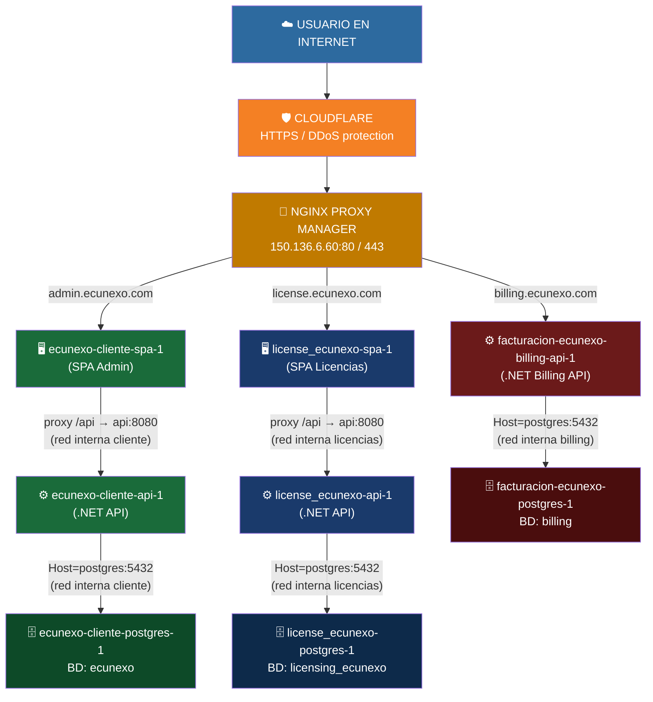
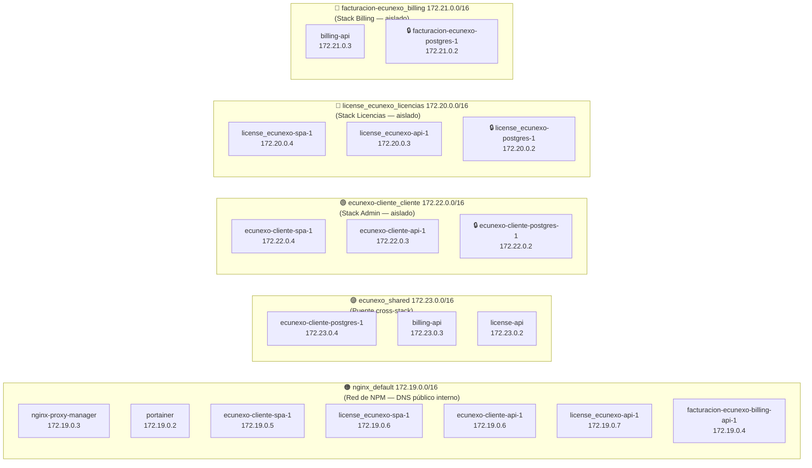
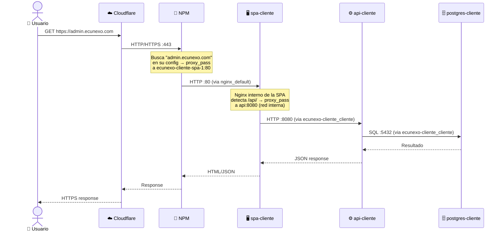
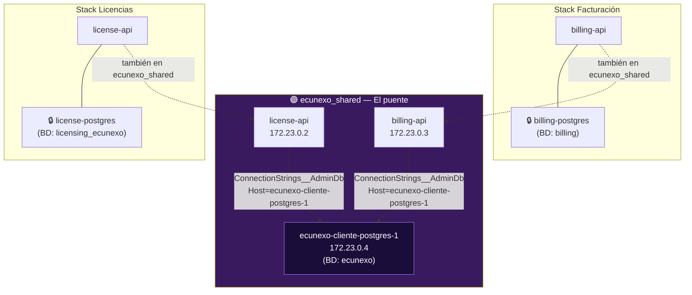

# 🐳 Cómo funciona la red Docker de EcuNexo
> Guía didáctica para estudiar la arquitectura del servidor de producción `150.136.6.60`

---

## 1️⃣ El concepto base — ¿Qué es una red Docker?

Piensa en las redes Docker como **cuartos dentro de un edificio**.  
Los contenedores que están en el mismo cuarto se pueden ver y hablar entre sí.  
Los que están en cuartos distintos **no se ven**, aunque estén en el mismo servidor físico.

```
┌─────────────────────────────────────────────────────────────────┐
│                   SERVIDOR  150.136.6.60                        │
│                                                                 │
│   ┌──────────────┐    ┌──────────────┐    ┌──────────────┐     │
│   │   Cuarto A   │    │   Cuarto B   │    │   Cuarto C   │     │
│   │              │    │              │    │              │     │
│   │  contenedor1 │    │  contenedor3 │    │  contenedor5 │     │
│   │  contenedor2 │    │  contenedor4 │    │  contenedor6 │     │
│   └──────────────┘    └──────────────┘    └──────────────┘     │
│                                                                 │
│   ✅ 1 habla con 2    ✅ 3 habla con 4    ✅ 5 habla con 6      │
│   ❌ 1 NO ve a 3      ❌ 2 NO ve a 5      ❌ 4 NO ve a 6        │
└─────────────────────────────────────────────────────────────────┘
```

---

## 2️⃣ El flujo completo — De internet hasta la base de datos



---

## 3️⃣ Las redes Docker — El mapa de los "cuartos"



---

## 4️⃣ ¿Por qué un contenedor puede estar en VARIAS redes?

Un contenedor puede tener **varias tarjetas de red** virtuales, una por cada red Docker a la que pertenezca.

```
┌─────────────────────────────────────────────────────────┐
│         ecunexo-cliente-spa-1                           │
│                                                         │
│   Tarjeta 1 ──► ecunexo-cliente_cliente (172.22.0.4)   │
│                  └── habla con: api, postgres           │
│                                                         │
│   Tarjeta 2 ──► nginx_default (172.19.0.5)             │
│                  └── habla con: NPM (recibe tráfico)    │
└─────────────────────────────────────────────────────────┘

┌─────────────────────────────────────────────────────────┐
│         license_ecunexo-api-1                           │
│                                                         │
│   Tarjeta 1 ──► license_ecunexo_licencias (172.20.0.3) │
│                  └── habla con: su spa, su postgres     │
│                                                         │
│   Tarjeta 2 ──► nginx_default (172.19.0.7)             │
│                  └── habla con: NPM                     │
│                                                         │
│   Tarjeta 3 ──► ecunexo_shared (172.23.0.2)            │
│                  └── habla con: ecunexo-cliente-postgres│
└─────────────────────────────────────────────────────────┘
```

---

## 5️⃣ Cómo NPM redirige el tráfico (proxy por nombre)



---

## 6️⃣ La red `ecunexo_shared` — El puente cross-stack



> **¿Por qué existe `ecunexo_shared`?**  
> La API de facturación necesita leer el inventario del cliente.  
> La API de licencias necesita cambiar configuraciones del tenant.  
> Ambas apuntan a `ConnectionStrings__AdminDb` → `ecunexo-cliente-postgres-1`.  
> Sin `ecunexo_shared`, los contenedores están en redes distintas y **no se ven**.

---

## 7️⃣ El problema clásico — ¿Por qué se rompe tras un redeploy?

```
ANTES (manual, frágil):
─────────────────────────────────────────────────────────────
  docker compose up -d          → contenedor nuevo sin redes extra
  docker network connect ...    → conexión manual (se pierde en el siguiente down)

  NPM → proxy_pass 150.136.6.60:5173  ← usa IP del HOST, no nombre de contenedor
  Si el puerto cambia → 💥 ROTO

DESPUÉS (declarativo, robusto):
─────────────────────────────────────────────────────────────
  docker-compose.yml declara:
    networks:
      npm_network:
        external: true
        name: nginx_default
      ecunexo_shared:
        external: true
        name: ecunexo_shared

  docker compose up -d   → contenedor nuevo YA tiene las redes correctas ✅
  NPM → proxy_pass ecunexo-cliente-spa-1:80  ← nombre de contenedor, siempre funciona ✅
```

---

## 8️⃣ Reglas de oro para no romper nada

```
┌─────────────────────────────────────────────────────────────────┐
│  REGLA 1                                                        │
│  NPM solo puede hacer proxy a contenedores que comparten        │
│  nginx_default con él. Siempre declara npm_network en el        │
│  compose del servicio que NPM proxea.                           │
├─────────────────────────────────────────────────────────────────┤
│  REGLA 2                                                        │
│  El postgres NUNCA va a nginx_default ni a ecunexo_shared       │
│  salvo que sea el postgres del cliente (es el compartido).      │
│  Agregar postgres a redes externas = riesgo de seguridad.       │
├─────────────────────────────────────────────────────────────────┤
│  REGLA 3                                                        │
│  NPM siempre usa nombre de contenedor, NUNCA la IP del host.    │
│  Las IPs de contenedores cambian en cada redeploy.              │
│  Los nombres de contenedores son estables.                      │
├─────────────────────────────────────────────────────────────────┤
│  REGLA 4                                                        │
│  La SPA hace proxy interno a la API por nombre de SERVICIO      │
│  Docker (no el nombre del contenedor). El servicio se llama     │
│  "api" en el compose → proxy_pass http://api:8080/              │
├─────────────────────────────────────────────────────────────────┤
│  REGLA 5                                                        │
│  Antes de crear una nueva red compartida, verifica que          │
│  docker network create <nombre> se ejecuta antes del deploy.    │
│  Si la red no existe, el compose falla al arrancar.             │
└─────────────────────────────────────────────────────────────────┘
```

---

## 9️⃣ Mapa de membresías por contenedor

| Contenedor | `nginx_default` | `ecunexo_shared` | Red interna del stack |
|-----------|:--------------:|:----------------:|:---------------------:|
| nginx-proxy-manager | ✅ (nativo) | ❌ | ❌ |
| portainer | ✅ | ❌ | ❌ |
| **ecunexo-cliente-spa-1** | ✅ | ❌ | ✅ `172.22.x` |
| **ecunexo-cliente-api-1** | ✅ | ❌ | ✅ `172.22.x` |
| 🔒 ecunexo-cliente-postgres-1 | ❌ | ✅ | ✅ `172.22.x` |
| **license_ecunexo-spa-1** | ✅ | ❌ | ✅ `172.20.x` |
| **license_ecunexo-api-1** | ✅ | ✅ | ✅ `172.20.x` |
| 🔒 license_ecunexo-postgres-1 | ❌ | ❌ | ✅ `172.20.x` |
| **billing-api** | ✅ | ✅ | ✅ `172.21.x` |
| 🔒 billing-postgres | ❌ | ❌ | ✅ `172.21.x` |

---

## 🔟 Checklist antes de cada deploy

```
[ ] 1. ¿El docker-compose.yml declara npm_network como externa?
       networks:
         npm_network:
           external: true
           name: nginx_default

[ ] 2. ¿El servicio que NPM proxea tiene npm_network en su sección networks?

[ ] 3. ¿Si necesita acceso cross-stack, declara ecunexo_shared como externa?
       networks:
         ecunexo_shared:
           external: true
           name: ecunexo_shared

[ ] 4. ¿La red ecunexo_shared ya existe en el servidor?
       Verificar: ssh oracle-ecunexo "sudo docker network ls | grep shared"
       Crear si no: ssh oracle-ecunexo "sudo docker network create ecunexo_shared"

[ ] 5. ¿En NPM el proxy host usa nombre de contenedor, no IP del host?
       ✅ Forward Host: ecunexo-cliente-spa-1  Port: 80
       ❌ Forward Host: 150.136.6.60          Port: 5173

[ ] 6. ¿El postgres del stack SOLO está en la red interna?
       (no debe aparecer en nginx_default ni en ecunexo_shared, salvo ecunexo-cliente-postgres)
```
