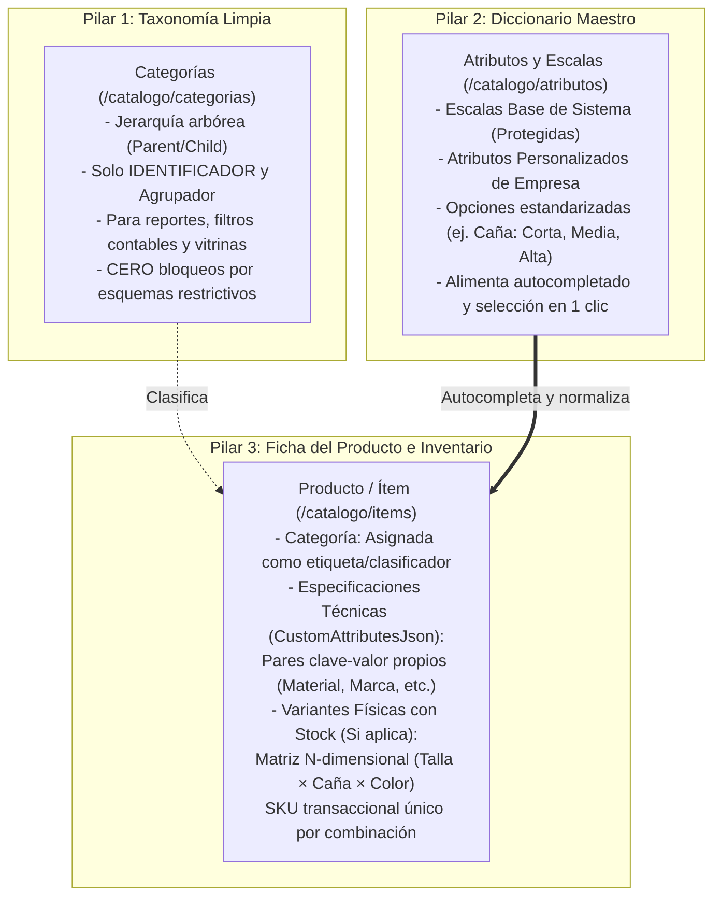

# Arquitectura de Catálogo: Ítems, Variantes y Diccionario de Atributos

Este documento establece los estándares de diseño, persistencia, flujos de usuario y reglas de negocio para el módulo de **Catálogo (`catalog`)** en EcuNexo.

---

## 1. Visión Holística: Los 3 Pilares del Catálogo

Para garantizar máxima consistencia de datos sin sacrificar la agilidad operativa diaria, el catálogo de EcuNexo se desacopla en tres pilares independientes pero estrechamente comunicados:

---

## 2. Pilar 1: Taxonomía Limpia (Categorías)

### Principio:
La Categoría (`Category`) es un **clasificador taxonómico puro**, no un molde restrictivo.

* **Función:** Organizar productos en familias y subfamilias (ej. *Ropa Deportiva > Calcetines*, *Ferretería > Herramientas Manuales*).
* **Uso Operativo:** Reportes de ventas por línea, filtros en DataGrids, cuentas contables y navegación en e-commerce.
* **Invariante de Dominio:** `CatalogItem.Create`, `CreateMatrixParent`, `CreateVariantChild` y `UpdateDetails` **NUNCA** deben bloquear el guardado exigiendo atributos obligatorios definidos en una categoría. La categoría acompaña al ítem pero no restringe sus especificaciones.

---

## 3. Pilar 2: Diccionario Corporativo de Atributos y Escalas (`/catalogo/atributos`)

Para erradicar la proliferación de términos duplicados o mal escritos (*"Caña"*, *"caña"*, *"Altura caña"*, *"Largo caña"*):

### Entidad Backend (`VariantDimensionTemplate`):
* **Tabla PostgreSQL:** `catalog.variant_dimension_templates`
* **Campos:**
  - `Id`, `TenantId`.
  - `Name`: Nombre normalizado (ej. *"Tipo de Caña / Altura"*, *"Medias / Calcetines"*, *"Materiales"*).
  - `DimensionType`: `"size"` (tallas/medidas), `"color"` (muestras cromáticas), `"custom"` (especificaciones generales).
  - `PredefinedValuesJson`: Array JSON con los valores estándar (ej. `["Invisible / No Show", "Tobillera / Corta", "Media Canilla", "Caña Alta"]`).
  - `IsSystemDefault`: `true` para escalas base precargadas para Ecuador; `false` para atributos de la empresa.

### Vista de Gestión ([`CatalogAttributesListPage.tsx`](file:///home/solivo/Documentos/ecunexo/Cliente/ecunexo_admin/src/pages/catalog/CatalogAttributesListPage.tsx)):
* Ruta: `/catalogo/atributos` (menú Catálogo con ícono `tags`).
* Grilla con buscador y filtros por tipo.
* Visualización de valores predefinidos en **chips visuales**.
* Invariante de seguridad: Las plantillas de sistema son **inmutables**; las personalizadas admiten edición y borrado con confirmación modal (`Popup`).

---

## 4. Pilar 3: Ficha del Producto y Variantes

### A. Especificaciones Propias del Ítem ([`ItemCustomAttributesEditor.tsx`](file:///home/solivo/Documentos/ecunexo/Cliente/ecunexo_admin/src/pages/catalog/ItemCustomAttributesEditor.tsx))
* Cualquier ítem (simple o producto matriz) puede definir sus propios atributos libres en `customAttributesJson`.
* **Autocompletado con Diccionario:** El input `Nombre del Atributo` cuenta con `<datalist>` conectado a los atributos registrados en el tenant.
* **Opciones Estandarizadas al Instante:** Si el atributo seleccionado coincide con el diccionario (ej. *"Caña"* o *"Color"*), se despliegan botones con las opciones sugeridas para rellenar el campo `Valor` con un solo clic.
* **Libertad Total:** El usuario puede ingresar cualquier texto ad-hoc si el producto tiene una propiedad atípica.

### B. Variantes Físicas con Control de Stock ([`VariantMatrixBuilder.tsx`](file:///home/solivo/Documentos/ecunexo/Cliente/ecunexo_admin/src/pages/catalog/VariantMatrixBuilder.tsx))
Cuando un producto físico tiene combinaciones que generan un SKU independiente y control de existencias en bodega (ej. Talla × Caña × Color):
1. **Modelo Auto-referencial (Parent-Child):**
   - **Producto Matriz (Padre):** `is_matrix_parent = true`, `parent_id = null`. Agrupa información comercial, marca, vitrina y especificaciones generales en `customAttributesJson`. **Nunca** almacena stock directo.
   - **Variante Física (Hijo):** `parent_id = [PadreId]`, `is_matrix_parent = false`. Cada combinación es un `CatalogItem` independiente con SKU único (`catalog.item.sku.unique`), precio base, saldo en bodega y movimientos de Kárdex.
2. **Motor Cartesiano N-Dimensional:**
   - Soporta hasta 4 dimensiones dinámicas ($D_1 \times D_2 \times D_3 \times D_4$) con producto cartesiano automático.
   - Nomenclatura SKU automática: `[MODELO]-[D1]-[D2]-[D3]...`.
3. **Fotografía Independiente por Variante:**
   - Cada variante física mantiene su propia imagen (`stagedImage` / `mainImageThumbUrl`), permitiendo reflejar el acabado real de cada SKU.

---

## 5. Matriz de Endpoints y CQRS

| Operación | Método & Endpoint | Comando / Query | Entidad Afectada |
| :--- | :--- | :--- | :--- |
| **Listar Atributos** | `GET /api/v1/tenants/{t}/catalog/variant-templates` | `ListVariantDimensionTemplatesQuery` | `VariantDimensionTemplate` |
| **Crear Atributo** | `POST /api/v1/tenants/{t}/catalog/variant-templates` | `CreateVariantDimensionTemplateCommand` | `VariantDimensionTemplate` |
| **Editar Atributo** | `PUT /api/v1/tenants/{t}/catalog/variant-templates/{id}` | `UpdateVariantDimensionTemplateCommand` | `VariantDimensionTemplate` |
| **Eliminar Atributo** | `DELETE /api/v1/tenants/{t}/catalog/variant-templates/{id}` | `DeleteVariantDimensionTemplateCommand` | `VariantDimensionTemplate` |
| **Crear Matriz** | `POST /api/v1/tenants/{t}/catalog/items/matrix` | `CreateCatalogItemMatrixCommand` | `CatalogItem` (Padre + Hijos) |
| **Añadir Variante a Ítem** | `POST /api/v1/tenants/{t}/catalog/items/{id}/variants` | `AddCatalogItemVariantCommand` | `CatalogItem` (Hijo) |
| **Listar Ítems** | `GET /api/v1/tenants/{t}/catalog/items?onlyRoots=true` | `ListCatalogItemsQuery` | `CatalogItem` |

---

## 6. Estándares UI/UX en Catálogo

1. **Vistas Dedicadas sobre Modales (Regla 9 & Skill `ui-vistas-sobre-modales`):**
   - Crear ítem (`/catalogo/items/nuevo`), Editar ítem (`/catalogo/items/:id`), Categorías (`/catalogo/categorias`), Atributos (`/catalogo/atributos`) son vistas completas con `PageHeader`, `SectionCard` y navegación RESTful.
   - Los modales (`Popup`) se reservan estrictamente para confirmaciones destructivas (eliminar atributo/categoría) o micro-interacciones rápidas (+ Añadir Variante puntual).
2. **Consistencia Glubox:**
   - Atomic inputs: `TextBox`, `Select`, `Button`, `ColorPicker`, `DataGrid`.
   - Rejilla responsiva M3: `ecu-stat-grid` para métricas y layouts fluidos a `1720px` max-width.
3. **No Duplicidad de Acciones (Regla 3):**
   - Acciones que ya aparecen como botones en `PageHeader.actions` nunca deben duplicarse en `actionItems` de `EcuPageActions`.
