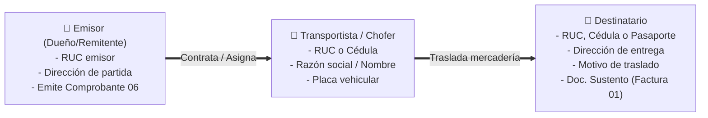
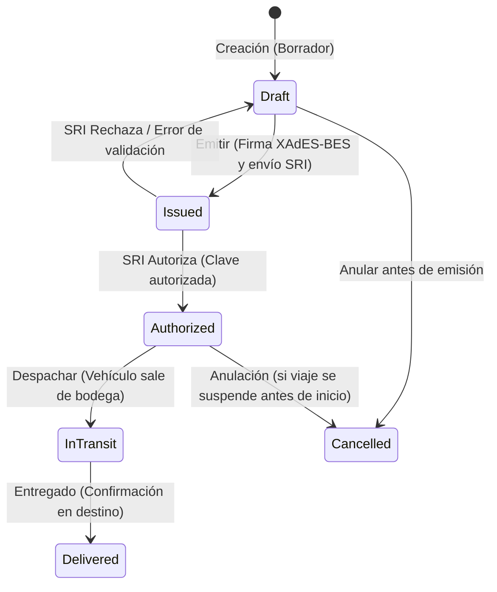

# Guías de Remisión Electrónicas SRI Ecuador (Comprobante Tipo 06)

Esta skill documenta las reglas normativas del Servicio de Rentas Internas (SRI de Ecuador), los estándares del Esquema Offline v1.1.0 (Ficha Técnica v2.32) y los patrones de arquitectura de software en EcuNexo para la creación, emisión, firma digital XAdES-BES, autorización y despacho de **Guías de Remisión Electrónicas (Tipo 06)**.

---

## 1. Alcance y Marco Normativo SRI

La **Guía de Remisión (Tipo 06)** es el comprobante tributario obligatorio que ampara el traslado físico de mercaderías dentro del territorio ecuatoriano, ya sea por transporte propio (privado) o mediante empresas de transporte contratadas (público / comercial).

### Finalidad Tributaria y Operativa:
1. **Sustentar el origen lícito de la mercadería:** Demuestra la procedencia, destino y motivo de movilización ante agentes de control del SRI, Aduana (SENAE) y Policía Nacional en carreteras y puntos de control.
2. **Amparar despachos por ventas:** Acompaña obligatoriamente a mercaderías vendidas con Factura electrónica (Comprobante 01).
3. **Amparar movimientos internos:** Traslado de existencias entre bodegas o sucursales de la misma empresa (traspasos de inventario).
4. **Devoluciones, consignaciones y demostraciones:** Mercadería en tránsito hacia proveedores, ferias o custodia temporal.

> [!CRITICAL]
> **Riesgo Legal e Incautación:** El transporte de mercadería sin Guía de Remisión autorizada o con inconsistencias en placas, fechas, ruta o destinatario faculta al SRI a la incautación preventiva de los bienes y sanciones pecuniarias al emisor y transportista.

---

## 2. Actores y Sujetos del Traslado

Una Guía de Remisión involucra obligatoriamente tres actores:



### A. Datos del Transportista:
* `razonSocialTransportista`: Nombre completo o razón social de la empresa de transporte o conductor independiente (hasta 300 caracteres).
* `tipoIdentificacionTransportista`:
  * `04`: RUC (13 dígitos).
  * `05`: Cédula de Identidad (10 dígitos).
  * `06`: Pasaporte.
* `rucTransportista`: Identificación numérica validada con algoritmo Módulo 10 o 11.
* `placa`: Placa del vehículo de transporte (obligatoria, alfanumérica, ej. `PBA-1234` o `PBA1234`, longitud 3 a 20 caracteres).

### B. Datos del Traslado:
* `dirPartida`: Dirección física exacta de la bodega o punto de salida de la mercadería.
* `fechaIniTransporte` (dd/mm/aaaa): Fecha de inicio del viaje. **No puede ser anterior a la fecha de emisión del documento de sustento.**
* `fechaFinTransporte` (dd/mm/aaaa): Fecha estimada de llegada. **Debe ser $\ge$ `fechaIniTransporte`.**

### C. Datos del Destinatario:
Una guía puede contener uno o múltiples bloques `<destinatario>` (viaje consolidado con entregas en varios puntos):
* `identificacionDestinatario`: RUC / Cédula del cliente o sucursal receptora.
* `tipoIdentificacionDestinatario`: `04` (RUC), `05` (Cédula), `06` (Pasaporte), `07` (Consumidor Final, solo casos especiales), `08` (Identificación del Exterior).
* `razonSocialDestinatario`: Nombre o razón social.
* `dirDestinatario`: Dirección física del punto de entrega.
* `motivoTraslado`: Texto descriptivo del motivo (ej. *Venta*, *Traslado entre bodegas*, *Consignación*, *Devolución*).
* `ruta`: Trayecto planificado (ej. *Quito - Latacunga - Ambato*).

---

## 3. Motivos de Traslado y Documentos de Sustento

El SRI exige especificar el motivo del viaje y vincular el comprobante que respalda la transacción:

| Motivo de Traslado | `codDocSustento` | ¿Requiere Factura previa? | Campos de Sustento Requeridos |
| :--- | :--- | :--- | :--- |
| **Venta de mercaderías** | `01` (Factura) | **Sí** | `numDocSustento` (`001-001-000000123`), `numAutDocSustento` (49 dígitos), `fechaEmisionDocSustento`. |
| **Traslado entre bodegas** | Opcional | **No** (Movimiento interno) | Si no hay factura, puede referenciar el documento de egreso/traspaso de bodega. |
| **Importación** | Opcional | **No** | `docAduaneroUnico` (DAI - Declaración Aduanera de Importación). |
| **Consignación** | Opcional | **No** | Contrato de consignación o nota de entrega. |
| **Devolución a proveedor** | `04` (Nota de Crédito) o `01` | Según el caso | Factura original o Nota de Crédito emitida. |
| **Ferias / Demostración** | Opcional | **No** | Hoja de salida o solicitud de demostración. |

---

## 4. Estructura Oficial del XML (Esquema Offline v1.1.0)

La Guía de Remisión electrónica sigue la versión `1.1.0` del XSD del SRI:

```xml
<?xml version="1.0" encoding="UTF-8"?>
<guiaRemision id="comprobante" version="1.1.0">
  <infoTributaria>
    <ambiente>2</ambiente>
    <tipoEmision>1</tipoEmision>
    <razonSocial>EMPRESA EMISORA S.A.S.</razonSocial>
    <nombreComercial>ECUNEXO STORE</nombreComercial>
    <ruc>1792146739001</ruc>
    <claveAcceso>2409202606179214673900120010010000000011234567814</claveAcceso>
    <codDoc>06</codDoc>
    <estab>001</estab>
    <ptoEmi>001</ptoEmi>
    <secuencial>000000001</secuencial>
    <dirMatriz>AV. AMAZONAS N24-123 Y CALDERON</dirMatriz>
    <!-- Etiquetas opcionales de régimen -->
    <contribuyenteRimpe>CONTRIBUYENTE RÉGIMEN RIMPE</contribuyenteRimpe>
  </infoTributaria>

  <infoGuiaRemision>
    <dirEstablecimiento>AV. AMAZONAS N24-123 Y CALDERON</dirEstablecimiento>
    <dirPartida>BODEGA CENTRAL - KM 5 VIA DAULE</dirPartida>
    <razonSocialTransportista>TRANSPORTES RAPIDOS DEL ECUADOR CIA. LTDA.</razonSocialTransportista>
    <tipoIdentificacionTransportista>04</tipoIdentificacionTransportista>
    <rucTransportista>0992345678001</rucTransportista>
    <obligadoContabilidad>SI</obligadoContabilidad>
    <fechaIniTransporte>24/09/2026</fechaIniTransporte>
    <fechaFinTransporte>25/09/2026</fechaFinTransporte>
    <placa>PBA-8942</placa>
  </infoGuiaRemision>

  <destinatarios>
    <destinatario>
      <identificacionDestinatario>1713328506001</identificacionDestinatario>
      <tipoIdentificacionDestinatario>04</tipoIdentificacionDestinatario>
      <razonSocialDestinatario>COMERCIAL ANDINA S.A.</razonSocialDestinatario>
      <dirDestinatario>CALLE ROCAFUERTE 502 Y MALECON, GUAYAQUIL</dirDestinatario>
      <motivoTraslado>VENTA CON ENTREGA A DOMICILIO</motivoTraslado>
      <ruta>QUITO - SANTO DOMINGO - GUAYAQUIL</ruta>
      <!-- Vínculo al documento de sustento (Factura) -->
      <codDocSustento>01</codDocSustento>
      <numDocSustento>001-001-000004521</numDocSustento>
      <numAutDocSustento>2309202601179214673900120010010000045211234567819</numAutDocSustento>
      <fechaEmisionDocSustento>23/09/2026</fechaEmisionDocSustento>
      <detalles>
        <detalle>
          <codigoInterno>SKU-CALZ-001</codigoInterno>
          <descripcion>ZAPATO INDUSTRIAL DE SEGURIDAD TALLA 42</descripcion>
          <cantidad>24.00</cantidad>
        </detalle>
        <detalle>
          <codigoInterno>SKU-GUAN-012</codigoInterno>
          <descripcion>GUANTES DE NITRILO REFORZADOS</descripcion>
          <cantidad>50.00</cantidad>
        </detalle>
      </detalles>
    </destinatario>
  </destinatarios>

  <infoAdicional>
    <campoAdicional nombre="EmailTransportista">chofer@transportesrapidos.com</campoAdicional>
    <campoAdicional nombre="TelefonoTransportista">0991234567</campoAdicional>
    <campoAdicional nombre="Observacion">Entrega en horario de 08:00 a 14:00</campoAdicional>
  </infoAdicional>
</guiaRemision>
```

---

## 5. Algoritmo de Clave de Acceso (49 Dígitos)

Para comprobante `06`, la clave de acceso sigue la regla unificada del SRI:

$$\text{Clave} = \text{Fecha (8)} + \text{TipoComprobante (06)} + \text{RUC (13)} + \text{Ambiente (1)} + \text{Establecimiento (3)} + \text{PuntoEmisión (3)} + \text{Secuencial (9)} + \text{CódigoNumérico (8)} + \text{TipoEmisión (1)} + \text{DV (1)}$$

* **Dígito Verificador (Módulo 11):** Factores `7, 6, 5, 4, 3, 2` de derecha a izquierda.
  * Si $\text{Residuo} = 0 \implies \text{DV} = 0$.
  * Si $\text{Residuo} = 1 \implies \text{DV} = 1$.
  * En cualquier otro caso: $\text{DV} = 11 - \text{Residuo}$.

---

## 6. Ciclo de Vida Operativo y Estados

En EcuNexo, la Guía de Remisión combina el ciclo tributario del SRI con el ciclo logístico de despacho:



| Estado | Significado Tributario / Logístico | Acciones Permitidas |
| :--- | :--- | :--- |
| **`Draft (1)`** | Borrador en preparación. Mercadería aún no sale. | Editar ítems, cambiar transportista, eliminar. |
| **`Issued (2)`** | Firmada digitalmente y enviada al WebService del SRI. | Consultar estado SRI. Bloqueada para edición. |
| **`Authorized (3)`** | Autorizada legalmente por el SRI con número de autorización. | Descargar XML/RIDE, Imprimir, Despachar (`InTransit`). |
| **`InTransit (4)`** | Vehículo en carretera transportando la mercadería. | Seguimiento logístico, Confirmar entrega (`Delivered`). |
| **`Delivered (5)`** | Mercadería entregada formalmente al destinatario. | Cerrar despacho, consultar histórico. |
| **`Cancelled (6)`** | Anulada tributariamente o cancelada por suspensión del traslado. | Solo consulta / auditoría. |

---

## 7. Arquitectura de Software en EcuNexo

### A. Capa de Dominio (`EcuNexo.Core.RemisionGuides`):
* **Agregado Raíz:** [`RemisionGuide.cs`](file:///home/solivo/Documentos/ecunexo/Cliente/ecunexo_api/src/EcuNexo.Core/RemisionGuides/RemisionGuide.cs)
  - Métodos: `Create`, `AddItem`, `RemoveItem`, `SetAccessKey`, `MarkAsIssued`, `MarkAsAuthorized`, `MarkAsInTransit`, `MarkAsDelivered`, `Cancel`.
  - Invariantes de dominio:
    - Validación de fechas: `startDate <= endDate`.
    - Placa vehicular no vacía y con longitud válida (3 a 20 chars).
    - Obligatoriedad de al menos 1 ítem transportado con `cantidad > 0`.
    - Si `supportDocumentNumber` está presente, valida formato `estab-ptoEmi-secuencial`.
* **Generador XML Oficial:** [`SriRemisionGuideXmlGenerator.cs`](file:///home/solivo/Documentos/ecunexo/Cliente/ecunexo_api/src/EcuNexo.Core/RemisionGuides/SriRemisionGuideXmlGenerator.cs)
  - Genera el árbol XML conforme al XSD `guiaRemision_V1.1.0`.

### B. Capa de Aplicación (`EcuNexo.Business.RemisionGuides`):
* **Comandos:**
  - `CreateRemisionGuideCommand`: Registra el borrador con ítems y transportista.
  - `UpdateRemisionGuideStatusCommand`: Transiciona estados (`InTransit`, `Delivered`, `Cancelled`).
* **Consultas:**
  - `ListRemisionGuidesQuery`: Grilla con filtros por rango de fechas, estado, destinatario y paginación.
  - `GetRemisionGuideByIdQuery`: Detalle completo para visualización e impresión del RIDE.

### C. Capa Frontend (`ecunexo_admin`):
* **Listado General:** [`RemisionGuidesListPage.tsx`](file:///home/solivo/Documentos/ecunexo/Cliente/ecunexo_admin/src/pages/facturacion/RemisionGuidesListPage.tsx)
  - Layout empresarial fluido (`.ecu-dashboard-layout--fluid`).
  - KPIs: Total Guías, Autorizadas, En Tránsito, Entregadas, Borradores.
  - Filtro por rango de fechas (`GridDateRangeBox`) y pestañas de estado (`OptionGroup`).
  - Acciones en grilla: Ver detalle modal, Descargar XML, Avanzar estado (`Despachar` / `Entregar`).
* **Formulario de Creación Dedicado:** [`RemisionGuideCreatePage.tsx`](file:///home/solivo/Documentos/ecunexo/Cliente/ecunexo_admin/src/pages/facturacion/RemisionGuideCreatePage.tsx)
  - Vista completa (Regla 9 & Skill `ui-vistas-sobre-modales`).
  - Secciones:
    1. Datos del Transporte (Chofer, Identificación, Placa, Fechas inicio y fin).
    2. Destinatario y Ruta (Punto de llegada, Motivo, Sustento/Factura).
    3. Mercadería a Transportar (Líneas de ítems con cantidad y SKU).

---

## 8. Integración con Kárdex y Facturación

### Flujo 1: Factura de Venta con Envío a Domicilio / Transporte
1. Se autoriza la Factura 01 en `/facturacion/nueva`.
2. Desde la factura autorizada, el operador hace clic en **«Generar Guía de Remisión»**.
3. El sistema precarga automáticamente:
   - Destinatario = Cliente de la factura.
   - Dirección de llegada = Dirección de entrega del cliente.
   - Documento de sustento = Factura 01 (`numDocSustento` y `numAutDocSustento`).
   - Ítems = Líneas de productos físicos de la factura.
4. El operador solo selecciona el transportista y la placa, y autoriza la guía.

### Flujo 2: Traspaso de Inventario entre Bodegas
1. Se crea un documento de inventario tipo `Transfer` en `/inventario/documentos/nuevo` (Bodega Matriz → Bodega Sucursal).
2. Se genera la Guía 06 con motivo: *"Traspaso entre bodegas de la misma empresa"*.
3. No requiere factura de sustento; respalda el tránsito legal de la mercadería en carretera.
4. Al llegar a destino, la guía pasa a `Delivered` y se aprueba la recepción en la bodega destino.

---

## 9. Matriz de Validaciones SRI y Prevención de Rechazos

| Código de Error SRI | Causa Frecuente | Prevención Automática en EcuNexo |
| :--- | :--- | :--- |
| **`PLACA INVALIDA`** | Placa vacía, menor a 3 caracteres o con caracteres no permitidos. | Validación regex en frontend y backend: `^[A-Z0-9-]{3,20}$`. |
| **`FECHA FIN MENOR A INICIO`** | `fechaFinTransporte` anterior a `fechaIniTransporte`. | Invariante de dominio `startDate <= endDate` antes de generar el XML. |
| **`FECHA INICIO ANTERIOR A SUSTENTO`** | La guía indica inicio de transporte antes de que se emitiera la factura que ampara los bienes. | Validación cruzada: `guide.StartDate >= invoice.IssueDate`. |
| **`RUC TRANSPORTISTA INVALIDO`** | Cédula o RUC con dígito verificador erróneo. | Validación estricta con algoritmo Módulo 10/11 en la entidad del transportista. |
| **`NUMERO SUSTENTO INVALIDO`** | Falta el formato `001-001-000000001` (17 caracteres). | El generador exige establecimiento (3), punto de emisión (3) y secuencial (9) con ceros a la izquierda. |
| **`DETALLE SIN ITEMS`** | Guía de remisión sin mercaderías o con cantidades en cero. | `RemisionGuide.AddItem` exige `quantity > 0` y la regla bloquea la emisión si `Items.Count == 0`. |

---

## 10. Reglas de Estilizado UI y Ergonomía (Anti-Tutorial)

Al construir o modificar pantallas de Guías de Remisión:
* Cumplir estrictamente la **Regla 11** y la skill `ui-compacta-sin-tutoriales`.
* Usar placeholders concisos (`Escriba aquí...`, `PBA-1234`, `001-001-000000001`).
* Prohibido incluir párrafos extensos explicando la ley de tránsito o el reglamento del SRI en los formularios.
* Mantener alta densidad visual con inputs atómicos de `glubox`.
