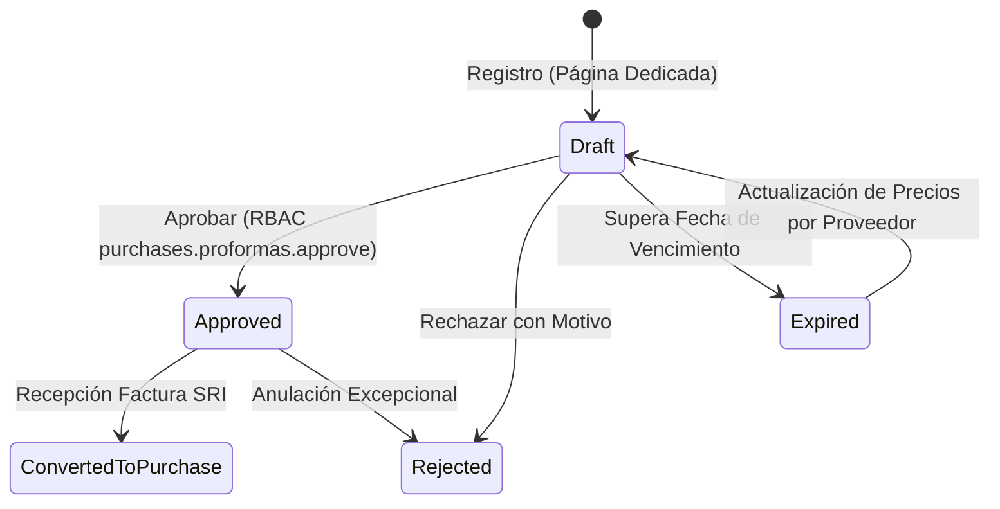

# Directorio de Proveedores & Gestión de Proformas (Ecuador)

Esta guía establece los estándares de arquitectura de dominio, reglas de negocio tributarias ecuatorianas, control de acceso granular (RBAC/ABAC) y diseño UI/UX para el Maestro de Proveedores y las Proformas / Cotizaciones de Compra en EcuNexo.

---

## 1. Naturaleza Comercial y Legal de la Proforma en Ecuador

En la práctica mercantil y tributaria ecuatoriana:
1. **Documento No Tributario:**
   * La proforma **no es un comprobante de venta autorizado por el SRI** (no sustituye a la Factura 01 ni a la Liquidación 03). No genera débito/crédito tributario de IVA ni retención en la fuente de forma directa.
   * Constituye una **oferta formal precontractual** que compromete especificaciones técnicas, precios unitarios, plazos de entrega y condiciones de pago.
2. **Fecha de Vencimiento y Plazo de Validez:**
   * En Ecuador, toda proforma comercial **debe incluir una fecha de emisión y una fecha de vencimiento / plazo de vigencia** (típicamente 8, 15 o 30 días calendario).
   * La volatilidad de precios, disponibilidad de stock o variaciones arancelarias/cambiarias exigen que superada la fecha de vencimiento, la proforma pase a estado `Expirada / Vencida` y **no pueda ser aprobada sin actualización previa del proveedor**.
3. **Modalidades de Cotización (Híbridas):**
   * **Modo A (Digital / Desglosada por Ítems):** Se detallan uno a uno los bienes o servicios cotizados con tarifa de IVA (15% general, 5% materiales de construcción, 0% insumos básicos, exento). Permite posterior conciliación automática línea por línea contra el kárdex e ingreso a bodega.
   * **Modo B (Documental / URL Externa / PDF):** El proveedor remite una cotización formal digitalizada o enlace a su portal/bucket. En este caso, **el desglose línea por línea en un grid es estrictamente OPCIONAL**. Se ingresa el Subtotal, IVA y Total consolidado junto a la URL del documento fuente.

---

## 2. Requisitos Mandatorios del Proveedor: Correo Electrónico Obligatorio

Para asegurar la trazabilidad comercial y el flujo de aprobación B2B:
* **`ContactEmail` Mandatorio:**
  * En la creación de un proveedor (`CreateSupplier`), el correo electrónico de contacto es **obligatorio y debe tener formato RFC 5322 válido**.
  * **Justificación operativa:** Al aprobar una proforma, el sistema emite una orden de confirmación automática por correo al proveedor. Además, es la dirección receptora obligatoria del RIDE y XML de los comprobantes de retención electrónica (SRI Tipo 07).
* **Validación de Identificación SRI:**
  * RUC Sociedades Privadas: Módulo 11 (tercer dígito = 9).
  * RUC Sector Público: Módulo 11 (tercer dígito = 6).
  * RUC Personas Naturales: Módulo 10 (primeros 2 dígitos provincia 01-24, 30 + 001).
  * Cédula de Identidad: Módulo 10.

---

## 3. Modelo de Autorización: RBAC & ABAC

El ciclo de compras maneja segregación de funciones estricta entre quien solicita, quien cotiza y quien autoriza el egreso financiero:

### 3.1 Matriz de Permisos RBAC
| Permiso | Rol Típico | Responsabilidad |
| :--- | :--- | :--- |
| `purchases.proformas.read` | Compras, Bodega, Finanzas | Consultar el directorio de proformas y revisar cotizaciones adjuntas. |
| `purchases.proformas.manage` | Asistente de Compras | Crear borradores de proformas, adjuntar enlaces PDF y editar cotizaciones en estado borrador. |
| `purchases.proformas.approve` | **Jefe de Compras, Gerencia, CFO** | **Aprobar formalmente la cotización**. Este permiso es restringido y no debe asignarse al personal operativo de registro. |
| `purchases.proformas.reject` | Jefe de Compras, Gerencia | Rechazar cotizaciones con registro mandatorio del motivo de rechazo. |

### 3.2 Políticas ABAC (Attribute-Based Access Control)
* **Validación de Vigencia Temporal (Attribute: ExpirationDate):**
  * Una proforma cuya fecha de vencimiento (`ExpirationDate`) sea anterior a la fecha actual (`DateOnly.FromDateTime(DateTime.UtcNow)`) **no puede ser aprobada**, bloqueando la acción con error de dominio `proforma.expired`.
* **Validación de Contacto del Proveedor (Attribute: Supplier.Email):**
  * Para ejecutar la aprobación, el proveedor vinculado debe poseer un correo electrónico activo registrado; de lo contrario se deniega la aprobación para evitar aprobaciones huérfanas sin notificación al oferente.
* **Umbrales de Monto Financiero (Opcional por Política del Tenant):**
  * Permite parametrizar aprobaciones de proformas superiores a determinado monto (ej. > $5,000 USD) exclusivamente para perfiles de Gerencia General.

---

## 4. Ciclo de Vida y Notificaciones Transaccionales

1. **Gatillado de Notificación por Correo al Proveedor:**
   * Al ejecutarse `ApprovePurchaseProformaCommand`, tras persistir el cambio de estado a `Approved`, se despacha mediante `IEmailSender` un correo estructurado al proveedor:
     * **Destinatario:** `Supplier.ContactEmail`.
     * **Asunto:** `Aprobación de Cotización N° {proformaNumber} — {Tenant.Name}`.
     * **Cuerpo:** Notificación formal de aceptación de precios, fecha límite de entrega acordada, desglose económico y advertencia de recepción de factura electrónica SRI.

---

## 5. Estándares UI/UX: Vista Dedicada (No Modal)

El registro de cotizaciones comerciales requiere visualización amplia de documentos, tablas de cálculo y comparativas, por lo que **no debe confinarse a una ventana modal**:

1. **Ruta Dedicada de Creación y Edición:**
   * `/compras/proformas/nueva`: Formulario de pantalla completa con layout empresarial.
   * `/compras/proformas/:id`: Vista de detalle con auditoría, estado de vigencia, acciones de aprobación y botón de conversión a compra.
2. **Layout Estructurado:**
   * `PageHeader`: Título, migas de pan (`Compras / Proformas / Nueva Cotización`), badge de estado y botones de acción en cabecera (Guardar Borrador, Cancelar).
   * `SectionCard 1 — Encabezado Comercial:` Proveedor (con selector inteligente y previsualización de RUC/Email/Crédito), Número de Proforma, Fecha de Emisión, **Fecha de Vencimiento**, y selector de **Modalidad de Registro**.
   * `SectionCard 2 — Modalidad de Registro (Toggle Segmentado):`
     * **Opción «Por Documento / Enlace Externo»:** Entrada destacada para URL de Object Storage / Drive / PDF, y resumen manual de Subtotal, IVA aplicable y Total. **Sin grid forzado**.
     * **Opción «Detalle por Ítems»:** DataGrid dinámico de líneas con cálculo en tiempo real de subtotales por tarifa de IVA (15%, 5%, 0%), botón «+ Agregar Línea» y totales consolidados.
   * `SectionCard 3 — Condiciones y Logística:` Días estimados de entrega, lugar de entrega en bodega, forma de pago acordada y observaciones.
