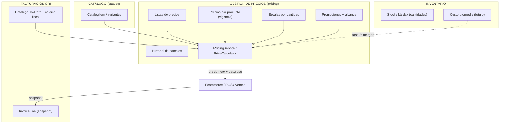
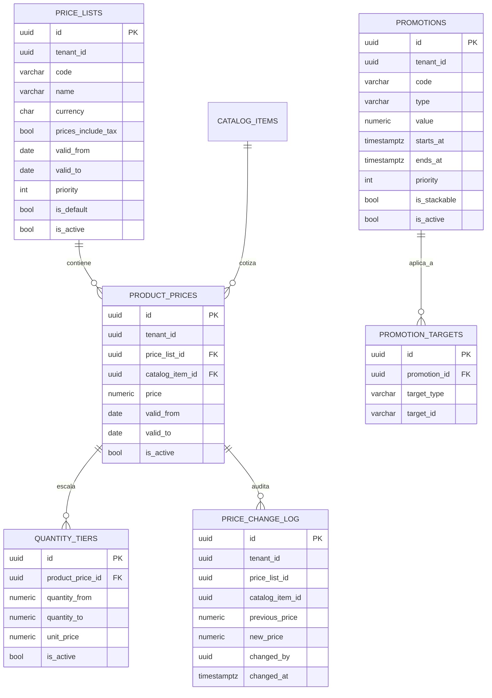

# Plan — Gestión de Precios (Pricing) en EcuNexo

> Documento de arquitectura y hoja de ruta para desacoplar el precio comercial del catálogo,
> centralizar las reglas de precio en un motor único y capturar el snapshot de venta.
> Acompañan a este plan las skills `pricing-listas-precios-vigencias`,
> `pricing-engine-resolucion-precios` y `pricing-ui-gestion-simulador`.

---

## 1. Resumen ejecutivo

Hoy el precio de venta es un único campo opcional `CatalogItem.BasePrice` dentro del catálogo; el
ecommerce confía en el precio que envía el cliente; el IVA está hardcodeado con dos convenciones
distintas; no existe lista de precios, vigencia, escala, promoción, historial de cambios ni costo
en inventario. El objetivo es incorporar una capacidad **Gestión de Precios**:

* Contexto acotado propio (`Core/Pricing`, `Business/Pricing`, esquema PostgreSQL `pricing`).
* Capacidad del módulo raíz `catalog` (permisos `catalog.pricing.*`), sin crear un módulo
  satélite ni tocar licenciamiento (taxonomía canónica de EcuNexo).
* Motor único `IPricingService` consumido por ecommerce, storefront, facturación y el futuro POS.
* Snapshot inmutable en el detalle de venta.
* UI en `ecunexo_admin` con listas, precios, promociones, historial y simulador.
* Impuestos delegados al mecanismo tributario existente (catálogo SRI de Facturación).

---

## 2. Cómo funciona hoy el manejo de precios

### 2.1 Precio

| Concepto | Dónde vive | Evidencia |
|---|---|---|
| Precio base | `CatalogItem.BasePrice` (`decimal?`, `numeric(18,4)`) | `ecunexo_api/src/EcuNexo.Core/Catalog/CatalogItem.cs:62`; `CatalogItemConfiguration.cs:77` |
| Herencia variante | `basePrice ?? parent.BasePrice` al crear la variante | `CatalogItem.cs:287` |
| API de captura | `Create/Update/Matrix/Variant` requests | `Api/Contracts/V1/Catalog/*.cs` |
| Vitrina pública | `Price ← BasePrice`; orden por `BasePrice` | `ListStorefrontProductsHandler.cs:79`; `StorefrontCatalogRepository.cs:47-53` |
| Tarifario de reparaciones | `CustomerRepairRateCard.RateN1/N2/N3` y `RepairBatch.AgreedRate...` | `Core/Customers/CustomerRepairRateCard.cs:24` |

No existe ninguna entidad de lista de precios, promoción, cupón ni precio por cliente/canal.

### 2.2 Costos

Inventario **no guarda costo**: `Stock`, `InventoryMovement` e `InventoryDocumentLine` solo tienen
cantidades. El costo promedio ponderado que describe la guía funcional
(`doc/modulo-catalogo-inventario-ecommerce.md:20,157,170-174`) no está implementado; el único
"costo" capturado es `PurchaseItem.UnitPrice` y no se propaga al kárdex.

### 2.3 Ventas, ecommerce y facturación

* El único agregado de venta es `EcommerceOrder`; **el precio viene del request del cliente**
  (`CreateEcommerceOrderHandler.cs:108-117`) y no se resuelve desde el catálogo.
* `EcommerceOrderItem` guarda `UnitPrice`, `DiscountAmount`, `TaxRate = 0.15` (fracción),
  `TaxAmount`, `TotalAmount` (`Core/Ecommerce/EcommerceOrderItem.cs:27-37`).
* Facturación (`Monorepo/Facturacion`) es otro servicio: la SPA calcula el IVA (0/5/15), Billing
  valida la aritmética de líneas y recalcula la cabecera; las tarifas viven en su catálogo
  `TaxRate` con vigencia (`BillingCatalogSeeds.cs`: IVA 0% rate `0`, 5% `5`, 15% `4`, no objeto
  `6`, exento `7`; 12%/14% históricos).
* No hay POS, cotizaciones de venta ni creación de facturas server-to-server.

### 2.4 Auditoría y permisos

* Auditoría: solo columnas `IAuditable` (`CreatedBy/UpdatedBy`), sin interceptor ni tabla de
  auditoría; en catálogo `created_by/updated_by` suelen quedar nulos.
* Permisos: códigos `modulo.recurso.accion` declarados en
  `Api/Development/MenuCatalogSeedData.cs` y aplicados con `PermissionFilters.Require`; el
  prefijo debe existir en `TenantModuleCodes` (`PermissionModuleMapper.cs:29`).
* No existe `pricing.*` ni página de precios en `ecunexo_admin`.

---

## 3. Problemas detectados frente al diseño objetivo

| # | Problema | Impacto |
|---|---|---|
| 1 | Precio único por ítem, sin listas ni vigencias | Imposible público/mayorista/distribuidor ni precios futuros |
| 2 | Historial inexistente: editar `BasePrice` sobrescribe | No se puede auditar quién/cuándo cambió ni el valor anterior |
| 3 | Sin escalas por cantidad ni promociones | El descuento se teclea a mano en cada venta |
| 4 | Ecommerce confía en el precio del cliente | Riesgo de manipulación de precios y de totales |
| 5 | IVA hardcodeado en 6+ lugares, con `15` vs `0.15` | Inconsistencia de cálculo y de redondeo |
| 6 | Sin costo en inventario | No hay margen mínimo ni control de descuento máximo |
| 7 | `BasePrice` editado sin usuario (`updatedBy` null) | Trazabilidad nula |
| 8 | Sin snapshot formal de venta | Cambiar un precio cambiaría el historial si se recalculara |
| 9 | Redondeo distinto entre frontend y validadores | Diferencias de 1 centavo y rechazos SRI |
| 10 | Promociones no modelables por categoría/cliente/canal | Rediseño inevitable si se improvisa |

---

## 4. Decisiones arquitectónicas

| # | Decisión | Recomendación |
|---|---|---|
| D1 | ¿Módulo raíz `pricing` o capacidad de `catalog`? | **Capacidad de `catalog`** con permisos `catalog.pricing.*`: la taxonomía canónica ubica «listas de precios base» en catálogo y prohíbe módulos satélite. Promover a módulo raíz solo con aprobación CEO + prompt de licenciamiento. |
| D2 | ¿Quién calcula impuestos? | Facturación/SRI es dueño del cálculo fiscal. Pricing resuelve precio neto y desglosa IVA mediante `ITaxRateProvider` (MVP: IVA 15% vigente, configurable por lista `prices_include_tax`). Investigación Ecuador pendiente (§12). |
| D3 | ¿Costo en Pricing? | Inventario es dueño del costo. Pricing lo consumirá vía abstracción (`IInventoryCostProvider`) recién cuando exista, solo para validar margen. |
| D4 | ¿Historial? | Inmutable por diseño: cambiar precio = cerrar vigencia + insertar fila nueva + registrar en `price_change_log` (el proyecto no tiene auditoría genérica). |
| D5 | ¿Lista predeterminada? | Única por tenant mediante índice único parcial; el motor cae a ella si no se especifica lista. |
| D6 | ¿Precisión monetaria? | `decimal`/`numeric(18,6)` y redondeo `AwayFromZero` a 2 decimales (alineado a SRI). |
| D7 | ¿Y `BasePrice`? | Se conserva como legado de transición; el motor lo usa como fallback hasta el corte y luego la UI deja de capturarlo. |
| D8 | ¿Ventas recalcularán? | No. Todo consumidor guarda snapshot del resultado del motor. |
| D9 | ¿Acoplamiento entre contextos? | Repositorios e interfaces viven en `Business/Pricing`; el resto de módulos solo referencia `IPricingService` y DTOs. Sin FK de `pricing` hacia módulos fuera de catálogo salvo `catalog.items` (y `category` lógico para targets). |

---

## 5. Arquitectura propuesta



Capas y carpetas (mismo patrón CQRS del proyecto):

```text
Core/Pricing/            PriceList, ProductPrice, QuantityTier, Promotion, PromotionTarget,
                         PriceChangeLog, PriceCalculator, errores de dominio
Business/Pricing/        IPricingService, PricingService, Commands/, Queries/, validators,
                         IPricingRepository, IPriceListRepository, IPromotionRepository
Data/                     Configurations/Pricing*Configuration.cs, Repositories/Pricing*.cs,
                         Migrations/*_AddPricingModule.cs
Api/                      Endpoints/V1/Pricing/PricingEndpoints.cs, Contracts/V1/Pricing/*
```

---

## 6. Modelo de datos final



Reglas de persistencia destacadas:

* `UNIQUE (tenant_id, code)` en `price_lists` y en `promotions`.
* `UNIQUE (tenant_id) WHERE is_default AND is_active AND deleted_at IS NULL` (predeterminada única).
* `UNIQUE (tenant_id, price_list_id, catalog_item_id, valid_from)` y constraint de exclusión GIST
  para evitar solapes de vigencia.
* Escalas sin rangos superpuestos por `product_price_id`.
* Índices por `(tenant_id, catalog_item_id, price_list_id, valid_from)` y `(tenant_id, is_active,
  starts_at)` en promociones.

---

## 7. Archivos nuevos y modificados

### 7.1 Backend — nuevos

| Archivo | Contenido |
|---|---|
| `src/EcuNexo.Core/Pricing/PriceList.cs` | Entidad + invariantes (predeterminada, vigencias, code) |
| `src/EcuNexo.Core/Pricing/ProductPrice.cs` | Entidad + solapamiento + cierre de vigencia |
| `src/EcuNexo.Core/Pricing/QuantityTier.cs` | Escala + validación de rangos |
| `src/EcuNexo.Core/Pricing/Promotion.cs` | Promoción + tipos + prioridad/acumulable |
| `src/EcuNexo.Core/Pricing/PromotionTarget.cs` | Alcance extensible |
| `src/EcuNexo.Core/Pricing/PriceChangeLog.cs` | Bitácora append-only |
| `src/EcuNexo.Core/Pricing/PriceCalculator.cs` | Cálculo puro (listas, escalas, promos, impuestos) |
| `src/EcuNexo.Business/Pricing/IPricingService.cs` | Contrato `ResolveAsync` |
| `src/EcuNexo.Business/Pricing/PricingService.cs` | Orquestación con repositorios |
| `src/EcuNexo.Business/Pricing/ITaxRateProvider.cs` + `EcuadorTaxRateProvider.cs` | Tarifa IVA |
| `src/EcuNexo.Business/Pricing/Commands/...` | Listas, precios, promociones (Create/Update/Deactivate) |
| `src/EcuNexo.Business/Pricing/Queries/...` | Listados, historial, resolución |
| `src/EcuNexo.Business/Pricing/I*Repository.cs` | Puertos del contexto |
| `src/EcuNexo.Data/Configurations/Pricing*Configuration.cs` | Mapeo EF (schema `pricing`, índices) |
| `src/EcuNexo.Data/Repositories/Pricing*Repository.cs` | Implementaciones |
| `src/EcuNexo.Api/Contracts/V1/Pricing/*.cs` | Requests/responses |
| `src/EcuNexo.Api/Endpoints/V1/Pricing/PricingEndpoints.cs` | Rutas + permisos |
| `src/EcuNexo.Data/Migrations/*_AddPricingModule.cs` | Migración EF |
| `tests/EcuNexo.Core.UnitTests/Pricing/*` | Reglas de negocio del motor |
| `tests/EcuNexo.Business.UnitTests/Pricing/*` | Handlers, tenant y resolución |

### 7.2 Backend — modificados

| Archivo | Cambio |
|---|---|
| `src/EcuNexo.Data/EcuNexoDbContext.cs` | Nuevos `DbSet<>` |
| `src/EcuNexo.Business/DependencyInjection.cs` | Registro de handlers, servicio y repositorios |
| `src/EcuNexo.Data/DependencyInjection.cs` | Registro de repositorios |
| `src/EcuNexo.Api/Program.cs` | `app.MapPricingEndpointsV1()` |
| `src/EcuNexo.Api/Development/MenuCatalogSeedData.cs` | Permisos `catalog.pricing.*` + ítems de menú |
| `src/EcuNexo.Business/Platform/Navigation/navigation.v1.json` | Fallback de navegación |
| `src/EcuNexo.Business/Ecommerce/Commands/CreateEcommerceOrder/*` | Resolver precio con `IPricingService` + snapshot |
| `src/EcuNexo.Core/Ecommerce/EcommerceOrderItem.cs` | Campos snapshot (`PriceListId`, `ListPrice`, reglas) |
| `src/EcuNexo.Business/Storefront/Queries/ListStorefrontProducts/*` | Precio desde lista predeterminada (fase 4) |
| `docs/adr/012-pricing-module.md` | Nuevo ADR con decisiones D1-D9 |

### 7.3 Frontend — nuevos

| Archivo | Contenido |
|---|---|
| `src/pages/catalog/pricing/PriceListsListPage.tsx` | Listado de listas |
| `src/pages/catalog/pricing/PriceListFormPage.tsx` | Alta/edición de lista |
| `src/pages/catalog/pricing/ProductPricesListPage.tsx` | Precios por producto (búsqueda multicriterio) |
| `src/pages/catalog/pricing/ProductPriceFormPage.tsx` | Nueva vigencia / cierre |
| `src/pages/catalog/pricing/PromotionsListPage.tsx` | Listado de promociones |
| `src/pages/catalog/pricing/PromotionFormPage.tsx` | Alta/edición de promoción |
| `src/pages/catalog/pricing/PriceHistoryPage.tsx` | Historial de cambios |
| `src/pages/catalog/pricing/PriceSimulatorPage.tsx` | Simulador (consume `resolve`) |
| `src/services/pricingApi.ts` | Cliente API del módulo |
| `src/types/pricingApi.ts` | DTOs |
| `tests-ui/comun/pricing-ui.spec.ts` | E2E Playwright |

### 7.4 Frontend — modificados

| Archivo | Cambio |
|---|---|
| `src/router/routes.tsx` | Rutas `catalogo/precios/...` |
| `src/lib/getPageTitle.ts` | Títulos de rutas con parámetro |
| `tests-ui/helpers/planMatrix.ts` | Rutas del módulo por plan (si aplica) |
| `src/pages/Dashboard/DashboardPage.tsx` | Atajo «Productos y Precios» hacia la nueva pantalla (opcional) |

---

## 8. Migraciones

Una sola migración inicial del contexto:

```bash
dotnet ef migrations add AddPricingModule \
  --project src/EcuNexo.Data --startup-project src/EcuNexo.Api
```

Incluye: esquema `pricing`, 6 tablas, índices compuestos, índice único parcial de lista
predeterminada, constraints de rango y la constraint de exclusión GIST (con extensión
`btree_gist` si no está habilitada). Se aplica con el `MigrateAsync` existente en `Program.cs`.

---

## 9. Plan de implementación backend

1. **Dominio** (`Core/Pricing`): entidades, value objects, errores `catalog.pricing.*`,
   `PriceCalculator` puro con tests.
2. **Aplicación** (`Business/Pricing`): puertos de repositorio, comandos/queries con validator
   FluentValidation, `PricingService`, `EcuadorTaxRateProvider`.
3. **Datos**: configuraciones EF, repositorios, migración, `DbSet`s.
4. **API**: contratos + endpoints con `PermissionFilters.Require`; registrar en `Program.cs`.
5. **RBAC y menú**: permisos y ítems en `MenuCatalogSeedData.cs` + `navigation.v1.json`;
   verificar arranque (el seeder revienta si un código de permiso es inválido).
6. **Integración ecommerce**: `CreateEcommerceOrder` resuelve con el motor (quitar confianza en
   `UnitPrice` del request), snapshot en `EcommerceOrderItem`, tests de regresión.
7. **Storefront** (fase 4): precio desde lista predeterminada; el orden por precio usa el precio
   resuelto.
8. **Tests**: dominio (16 escenarios), handlers, aislamiento multi-tenant y precisión decimal.

---

## 10. Plan de implementación frontend

1. `pricingApi.ts` + tipos.
2. Rutas y menú (el menú llega del backend; las rutas se registran en `routes.tsx`).
3. Listado + formulario de **listas** (primero, porque habilita todo lo demás).
4. Listado + formulario de **precios por producto** con búsqueda por código, barras, nombre,
   categoría y lista; alta de vigencia sin destruir historial.
5. **Promociones** con prioridad, acumulabilidad y alcance.
6. **Historial** de solo lectura con filtros por producto/lista/fechas.
7. **Simulador** consumiendo `POST .../pricing/resolve` (mismo motor que ventas).
8. E2E Playwright y capturas claro/oscuro/móvil.

---

## 11. Integración con ventas y facturación

```text
POST /catalog/pricing/resolve
        │  (mismo servicio para simulador, ecommerce, POS y facturación)
        ▼
PricingResult (desglose + reglas aplicadas)
        │
        ├─ EcommerceOrder: guardar snapshot en la línea al crear el pedido
        ├─ Facturación (SPA): prellenar InvoiceLine con el snapshot
        └─ POS/Ventas (futuro): consumir el mismo contrato
```

* **Ecommerce**: reemplaza el `UnitPrice` del request por el resuelto; mantiene compatibilidad
  temporal con el precio legado y lo marca en `AppliedRules`.
* **Facturación**: no se modifica `Billing.Api`; la SPA usa `resolve` para calcular y enviar las
  líneas ya validadas por el motor. La validación fiscal de Billing sigue siendo la autoridad
  final del comprobante.
* **Histórico**: los detalles guardados no se recalculan nunca.

---

## 12. Impuestos Ecuador — investigación pendiente (bloqueador de producción)

> **Estado:** abierto. `EcuadorTaxRateProvider` responde 15% fijo; no usar listas con
> `pricesIncludeTax = true` en producción hasta cerrar esta definición (la factura ya desagrega
> la base correctamente, pero la tarifa por ítem y la decisión de negocio siguen pendientes).

Antes de la fase 4 hay que cerrar con contabilidad/negocio:

1. ¿Los precios de góndola se manejan con IVA incluido? (`prices_include_tax`).
2. Tarifa por ítem/categoría y vigencias (15% general, 5%, 0%, no objeto, exento).
3. ¿`FinalPrice` devuelve IVA incluido o el IVA se agrega solo en la factura?
4. Confirmación de redondeo `AwayFromZero` a 2 decimales extremo a extremo (SRI).
5. Notas de crédito y devoluciones: partir del snapshot original.
6. RIMPE, retenciones y propina: fuera del precio unitario; se resuelven en Facturación.

Referencias existentes: skill `facturacion-sri-ecuador`, catálogo `TaxRate` y validadores de
`Monorepo/Facturacion`, skills SRI compartidas del proyecto de facturación.

---

## 13. Fases

| Fase | Alcance | Entregable verificable |
|---|---|---|
| **0. Contrato** | ADR 012, skills, decisiones D1-D9, investigación tributaria | ADR aprobado + skills en repo |
| **1. Dominio y datos** | Entidades, `PriceCalculator`, migración `AddPricingModule` | Tests de dominio en verde |
| **2. Servicio y API** | `PricingService`, endpoints, permisos, menú, seeders | Tests de handlers + API smoke |
| **3. Frontend** | Listas, precios, promociones, historial, simulador | `pnpm build` + E2E del módulo |
| **4. Integración** | Ecommerce server-side, snapshot, storefront, prefill de facturación | Tests de regresión ecommerce |
| **5. Futuro** | Cliente/segmento/canal/sucursal, cupones, combos, 2x1/3x2, margen mínimo, precio mínimo, autorizaciones, contratos | Diseño ya habilitado por el modelo |

No se implementa nada de la fase 5 en esta iteración; el modelo y el contrato ya la soportan.

---

## 14. Flujo completo

```text
Producto (catálogo)
   ↓
Lista de precios (explícita o predeterminada del tenant)
   ↓
Precio vigente (fecha; herencia de padre matriz si aplica)
   ↓
Escala por cantidad (mayor quantity_from aplicable)
   ↓
Promoción aplicable (prioridad + acumulabilidad)
   ↓
Descuento (porcentaje / valor fijo / precio fijo)
   ↓
Precio neto
   ↓
Impuesto (ITaxRateProvider; IVA incluido o sumado según la lista)
   ↓
Precio final + reglas aplicadas
   ↓
Venta / Ecommerce / Facturación (snapshot inmutable en el detalle)
```

---

## 15. Riesgos y mitigaciones

| Riesgo | Mitigación |
|---|---|
| Romper el ecommerce al dejar de confiar en `UnitPrice` | Compatibilidad temporal + tests de regresión + feature de corte por fase |
| Divergencia de IVA entre Pricing y Facturación | Abstracción `ITaxRateProvider` y una sola fuente de tarifas (SRI) |
| Solapes de vigencia por concurrencia | Constraint de exclusión en BD + validación en handler |
| Datos legados en `BasePrice` | Fallback explícito y migración controlada, sin borrar la columna |
| Crecimiento de reglas (fase 5) | `promotion_targets` extensible y request con campos reservados |
| Falta de auditoría genérica | `price_change_log` append-only y población de `CreatedBy/UpdatedBy` desde el caller |

---

## 16. Criterios de aceptación

1. Un producto puede tener precios distintos por lista y por vigencia, con historial intacto.
2. El motor resuelve lista → escala → promoción → descuento → impuesto → precio final y devuelve
   `AppliedRules`; los 16 escenarios de prueba pasan.
3. Ningún módulo consumidor calcula precios por su cuenta.
4. El ecommerce crea pedidos con precio resuelto por el backend y snapshot en la línea.
5. La UI permite operar listas, precios, promociones e historial, y simular con el mismo motor.
6. Aislamiento multi-tenant verificado (no se puede leer ni aplicar pricing de otra empresa).
7. `dotnet build EcuNexo.slnx`, suites .NET y `pnpm build` en verde; E2E del módulo operativo.

---

## 17. Artefactos relacionados

* Skills: `pricing-listas-precios-vigencias`, `pricing-engine-resolucion-precios`,
  `pricing-ui-gestion-simulador`.
* Skills de apoyo: `ecunexo-module-taxonomy-reasoning`, `rbac-permisos-seeding`,
  `catalogo-arquitectura-variantes-atributos`, `facturacion-sri-ecuador`,
  `inventario-bodegas-kardex`, `ecommerce-pedidos-stock`, `glubox-enterprise-ui`,
  `ui-vistas-sobre-modales`.
* ADR propuesto: `ecunexo_api/docs/adr/012-pricing-module.md`.
