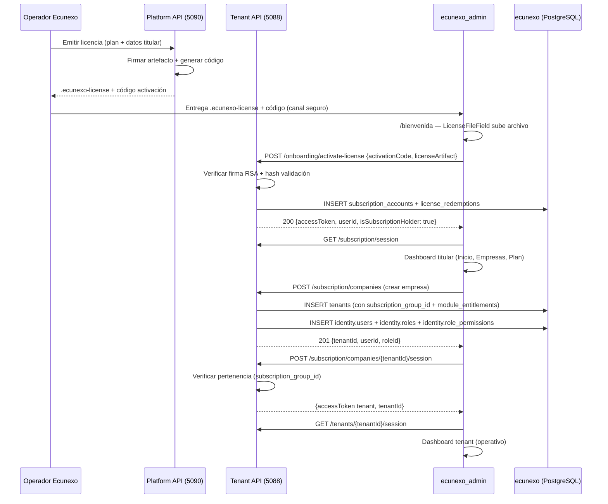

# 14 — Onboarding: licencia comercial, titular y empresas

Este documento describe los flujos de **alta inicial** en EcuNexo. Hay **dos caminos** coexistiendo:

| Flujo | Endpoint | Resultado |
|---|---|---|
| **Comercial (recomendado)** | `POST /api/v1/onboarding/activate-license` | Crea **titular** (`subscription_accounts`); el cliente crea empresas después vía `/subscription/companies` |
| **Legacy (dev/seeds)** | `POST /api/v1/onboarding/tenant-with-activation` | Crea **tenant + admin + rol** en un solo paso usando `activation_codes` |

> **Modelo de negocio actual**: [[platform-licensing/10-modelo-titular-suscripcion-rbac]]. Seguridad del artefacto: [[platform-licensing/09-seguridad-licencias-desacopladas]].

---

## A. Flujo comercial — `activate-license` (v1 productivo)

### A.1. Resumen del flujo completo



1. **Ecunexo emite** en platform (`ecunexo_license_api`): `activationCodePlaintext` + archivo `.ecunexo-license`.
2. **Cliente canjea** en `/bienvenida` (SPA `ecunexo_admin`):

   `POST /api/v1/onboarding/activate-license` — body: `{ "activationCode", "licenseArtifact" }`.

3. **Primera vez**: `ActivateLicenseHandler` verifica firma RSA y doble hash, crea `tenancy.subscription_accounts` + `tenancy.license_redemptions`.
4. **Canjes posteriores** (mismo grantId): valida credenciales del titular y emite JWT sin duplicar filas.
5. **Reemisión**: si el artefacto tiene `supersedesGrantId`, reemplaza la licencia del titular (`ReplaceLicenseGrant`).
6. Respuesta **200**: `{ accessToken, expiresAt, userId, tenantId: null, isSubscriptionHolder: true }`.

### A.2. Flujo en el SPA (`ecunexo_admin`)

| Paso | Componente | Acción |
|------|-----------|--------|
| 1 | `WelcomeLayout` | Layout `/bienvenida` (login-page + glow) |
| 2 | `WelcomeOnboardingPage` | Formulario: código activación + `LicenseFileField` (upload `.ecunexo-license`) |
| 3 | `LicenseFileField` | `readLicenseFile()`: parsea JSON, valida versión, extrae `artifactJson` |
| 4 | `activateLicense()` | `POST /api/v1/onboarding/activate-license` |
| 5 | `setCredentials` + `fetchSubscriptionSession` | Persiste JWT en Redux + carga menú y permisos de suscripción |
| 6 | `navigate('/inicio')` | Dashboard titular con menú: Inicio, Empresas, Plan |

### A.3. Flujo de login del titular

Cuando el titular ya tiene cuenta y vuelve a `/`:

| Paso | Componente | Acción |
|------|-----------|--------|
| 1 | `LoginLayout` | Layout login (respeta tema del usuario, sin hardcodeo) |
| 2 | `LoginPage` → `CardLogin` | Formulario email + contraseña |
| 3 | `loginThunk` | `POST /api/v1/auth/login` |
| 4 | `LoginHandler` | Busca `SubscriptionAccount` por email → `LoginSubscriptionAccountAsync` |
| 5 | `LicenseComplianceService.EnsureCompliantAsync` | Verifica expiración y validación online (offline-first) |
| 6 | `fetchSubscriptionSession` | `GET /api/v1/subscription/session` → menú + permisos |
| 7 | `navigate('/inicio')` | Dashboard titular |

### A.4. Handlers y tablas

| Handler | Función |
|---------|---------|
| `ActivateLicenseHandler` | Canje offline: verifica artefacto, crea/actualiza `SubscriptionAccount`, registra `LicenseRedemption`, emite JWT titular |
| `LoginHandler` (modo suscripción) | Login titular: valida credenciales contra `SubscriptionAccount`, ejecuta `LicenseComplianceService`, emite JWT |
| `ProvisionSubscriptionCompanyHandler` | Crea empresa (tenant + admin + rol con permisos filtrados por módulos) |
| `SwitchToCompanySessionHandler` | Entra a una empresa: emite JWT tenant para el titular |
| `GetSubscriptionSessionHandler` | Handshake: menú y permisos del titular |

| Tabla | Uso |
|-------|-----|
| `tenancy.subscription_accounts` | Titular de licencia (email, password, grantId, plan, módulos, fechas compliance) |
| `tenancy.license_redemptions` | Canje idempotente (`id` = grantId, `subscription_account_id`) |

### A.5. Compliance en cada login

El `LoginHandler` invoca `LicenseComplianceService.EnsureCompliantAsync` para:

1. **Titular**: al loguearse directamente con email/contraseña → verifica licencia no expirada ni revocada online.
2. **Usuario tenant**: busca `SubscriptionAccount` por `tenant.SubscriptionGroupId` y verifica compliance del titular antes de permitir login del usuario.

El `ActivateLicenseHandler` **no** llama compliance en el primer canje (la licencia recién se activa). En canjes posteriores (login), el compliance ya está activo.

Ver detalle en: [[platform-licensing/13-compliance-reissue]].

### A.6. Permisos del admin de empresa

Al provisionar, el rol **Administrador** recibe permisos activos del catálogo **filtrados por `enabled_modules` de la licencia** (`ModulePermissionFilter`), no necesariamente todo el catálogo global.

### A.7. Re-canje

Si el `grantId` ya está en `license_redemptions`, `activate-license` valida credenciales del titular y devuelve JWT de suscripción (login), sin duplicar filas.

---

## B. Flujo legacy — `tenant-with-activation` (dev / seeds)

Este capítulo original describe el flujo **legacy** con tabla `tenancy.activation_codes`. **No** usar para licencias comerciales nuevas (usar §A).

> El resto de este documento (§B.1 en adelante) aplica al flujo legacy.

## B.1. Por qué existe el flujo legacy

| Objetivo | Cómo se cumple |
|---|---|
| **No exponer** el plan completo en la UI antes de validar licencia | El cliente envía un **código**; el servidor valida contra datos persistidos (huella), no contra “promesas” solo en front. |
| **Ligar** cupo de empresas (tenants), usuarios, bodegas y módulos a un **contrato / emisión** | Los valores vienen de la fila `tenancy.activation_codes` y se copian al tenant creado (`subscription_max_tenants`, `enabled_modules`). |
| **Primer usuario administrador** sin flujos manuales de GUID | Un solo `POST` devuelve `tenantId`, `userId`, `roleId`. |
| **Varias empresas** con el mismo código (holding / multi-empresa) | El código lleva `max_tenants` y `provisioning_slots_remaining`: cada onboarding exitoso **descuenta un slot** hasta agotar el código. |

> ⚠️ **No hay contraseña** en el alta por código todavía: el usuario se crea como en el resto de Identity (perfil + email). El login con credencial propia y el “olvido de contraseña” son trabajo pendiente de la capa de autenticación.

> 💡 El código que teclea el cliente **no se guarda en claro** en BD: solo una **huella** irreversible (ver §B.3).

---

## B.2. Configuración (`appsettings` y variables de entorno)

| Clave | Dónde | Significado |
|---|---|---|
| **`ActivationCodes:Pepper`** | `src/EcuNexo.Api/appsettings.json` (y override en `appsettings.Development.json`) | Secreto de aplicación usado **solo en servidor** para derivar la huella del código. **Debe ser distinto** en cada entorno y **largo** en producción; rotarlo invalida códigos emitidos con el pepper anterior si no migráis hashes. |
| **`ConnectionStrings:Default`** | Igual que siempre | PostgreSQL para persistir `activation_codes` y tenants. |

Registro en host: `Program.cs` → `Configure<ActivationCodeOptions>(...)` + `AddScoped<IActivationCodePepperProvider, ActivationCodePepperProvider>()`.

Archivos:

- `src/EcuNexo.Api/Configuration/ActivationCodeOptions.cs` — sección `ActivationCodes`.
- `src/EcuNexo.Api/Tenancy/ActivationCodePepperProvider.cs` — implementa `IActivationCodePepperProvider` (capa Business).

> ⚠️ Si `Pepper` está vacío, el comando `OnboardTenantWithActivation` falla con error de configuración (`onboard.pepper.missing`): es intencional para no aceptar códigos sin secreto configurado.

---

## B.3. Código de activación: qué es “el hash” y qué guarda la BD

### B.3.1. Normalización y huella

1. **Normalizar** el texto que escribe el usuario: `Trim()` + mayúsculas invariantes (`ActivationCodeHasher.Normalize`).
2. Calcular **SHA-256** sobre UTF-8 de la cadena `"{pepper}|{códigoNormalizado}"` y persistir el resultado en **hexadecimal mayúsculas** (`ActivationCodeHasher.ComputeHash`).

Así, dos personas con el mismo código y el mismo servidor (mismo pepper) generan la misma fila; quien no conoce el pepper no puede fabricar huellas válidas desde el exterior sin fuerza bruta sobre el espacio de códigos (debéis usar códigos suficientemente entropía en producción).

### B.3.2. Tabla `tenancy.activation_codes` (resumen de columnas)

| Columna (snake_case) | Uso |
|---|---|
| `id` | UUID (v7 en emisión típica vía `IIdGenerator`). |
| `code_hash` | Huella única (índice único). |
| `plan_label` | Se materializa en `tenants.plan_name` del **ServicePlan** embebido al crear el tenant. |
| `max_tenants` | Cupo de **empresas** que este código puede provisionar; también es el valor inicial de `provisioning_slots_remaining`. |
| `max_users` / `max_warehouses` | Límites del plan en el **ServicePlan** del tenant. |
| `enabled_module_codes` | **jsonb**: lista de códigos de módulo de producto (ver §4). |
| `expires_at_utc` | Caducidad del código. |
| `provisioning_slots_remaining` | Se decrementa en cada onboarding exitoso; al llegar a `0` se rellenan `consumed_at_utc` y `consumed_by_tenant_id` (último tenant provisionado). |
| `created_at_utc` | Auditoría de emisión. |
| `consumed_at_utc` / `consumed_by_tenant_id` | Indican agotamiento (cuando no quedan slots). |
| `xmin` | Concurrency token (PostgreSQL). |

Entidad de dominio: `EcuNexo.Core/Tenancy/ActivationCode.cs`. Configuración EF: `Configurations/ActivationCodeConfiguration.cs`.

---

## B.4. Módulos de producto (`enabled_modules` en el tenant)

Los códigos reconocidos hoy están en **`TenantModuleCodes`** (`EcuNexo.Core/Tenancy/TenantModuleCodes.cs`):

| Código | Significado orientativo |
|---|---|
| `identity` | Administración de identidad / permisos en la UI (cuando existan pantallas). |
| `catalog` | Catálogo de productos. |
| `warehousing` | Bodegas / almacenes. |
| `inventory` | Inventario / existencias. |
| `invoicing` | Facturación. |

Se persisten en **`tenancy.tenants.enabled_modules`** como **jsonb** (lista de strings). **`null`** en esa columna significa compatibilidad con tenants **anteriores** al feature: interpretación “sin restricción explícita por módulo” en capas futuras (middleware / menú SPA).

**`subscription_max_tenants`** en `tenancy.tenants` copia el `max_tenants` del código en el momento del alta; sirve para **futuras** validaciones (“¿puede este titular crear otra empresa?”) cuando exista identidad de suscripción o panel de plataforma.

> 💡 Los **permisos** RBAC son otro concepto. En el flujo **legacy**, el onboarding otorga todos los permisos activos al Administrador. En el flujo **comercial**, al provisionar empresa vía `/subscription/companies`, los permisos se **filtran por módulos** de la licencia.

---

## B.5. Endpoint HTTP (legacy)

| Método | Ruta | Tag OpenAPI |
|---|---|---|
| `POST` | `/api/v1/onboarding/tenant-with-activation` | `Onboarding` |

**No lleva `tenantId` en la URL**: es bootstrap; durante la petición `ITenantContext.CurrentTenantId` suele ser **null** (coherente con `POST /api/v1/tenants`).

### B.5.1. Cuerpo JSON (camelCase)

Contrato: `src/EcuNexo.Api/Contracts/V1/Tenancy/OnboardTenantWithActivationRequest.cs` → comando `OnboardTenantWithActivationCommand`.

| Campo | Obligatorio | Descripción |
|---|---|---|
| `activationCode` | Sí | Texto tal como lo entrega comercial / licencia (se normaliza en servidor). |
| `tenantName` | Sí | Nombre comercial del tenant. |
| `ownerEmail` | Sí | Email del primer usuario (único por tenant). |
| `ownerName` | Sí | Nombre para mostrar. |
| `tenantDisplayName` | No | Branding UI. |
| `timeZoneId` | No | IANA, p. ej. `America/Guayaquil`. |
| `locale` | No | BCP 47, p. ej. `es-EC`. |
| `logoUrl` | No | URL del logo. |
| `primaryColorHex` | No | `#RGB` o `#RRGGBB`. |
| `ownerDepartment` | No | Departamento. |
| `ownerPhone` | No | Teléfono. |
| `ownerJobTitle` | No | Puesto. |

### B.5.2. Respuesta exitosa

- **201 Created**
- Cuerpo: `{ "tenantId", "userId", "roleId" }` (`OnboardTenantWithActivationResponse`).
- Cabecera **`Location`**: `/api/v1/tenants/{tenantId}`.

### B.5.3. Errores típicos (ProblemDetails)

| Situación | Código orientativo | HTTP |
|---|---|---|
| Validación FluentValidation | `onboard.validation` | 400 |
| Código incorrecto / expirado / agotado | `onboard.activation.not_found` u otros de dominio `activation.*` | 404 / 409 / 400 según `ErrorType` |
| Pepper no configurado | `onboard.pepper.missing` | 500 |
| Email duplicado en el tenant (raro en primer alta) | `onboard.owner.email_duplicate` | 409 |

Mapeo: `Extensions/ResultHttpExtensions.cs`.

---

## B.6. Caso de uso en Business (CQRS legacy)

| Pieza | Ubicación |
|---|---|
| Comando | `EcuNexo.Business/Tenancy/Commands/OnboardTenantWithActivationCommand.cs` |
| Respuesta | `OnboardTenantWithActivationResponse.cs` |
| Validador | `OnboardTenantWithActivationValidator.cs` |
| Handler | `OnboardTenantWithActivationHandler.cs` |
| Repositorio de códigos | `IActivationCodeRepository` + `Data/Repositories/ActivationCodeRepository.cs` |

Orden lógico dentro del handler (todo en **un** `SaveChangesAsync`):

1. Validar comando y pepper.
2. Resolver **huella** y cargar `ActivationCode` **con tracking** EF.
3. Crear agregado **Tenant** con `ServicePlan` derivado del código + `SubscriptionMaxTenants` + `EnabledModuleCodes`.
4. Comprobar email no duplicado en ese `tenantId`.
5. Crear **Role** “Administrador” (`isSystem: true`).
6. Crear **User** propietario.
7. Para cada **Permission** global no eliminada y con `Status == Active`, crear **RolePermission**.
8. Crear **UserRole**.
9. Llamar `activation.RecordProvisioning(tenantId, utcNow)` (descuenta slot; puede marcar consumo final).
10. `AddAsync` en repos correspondientes + `IUnitOfWork.SaveChangesAsync`.

Registro DI: `DependencyInjection.cs` en Business (`ICommandHandler<OnboardTenantWithActivationCommand, ...>`) y Data (`IActivationCodeRepository`).

---

## B.7. Seed en Development

Orden en `Program.cs` (importante):

1. **`DevelopmentActivationCodeSeeder.EnsureAsync`** — si la tabla `activation_codes` está **vacía**, inserta **un** código de prueba cuya huella corresponde al texto en claro documentado abajo.
2. **`DevelopmentCatalogSeeder.EnsureSeedAsync`** — si **no hay ningún tenant**, crea el demo **Everchic Demo** (igual que antes).

Archivos:

- `Development/DevelopmentActivationCodeSeeder.cs`
- `Development/DevelopmentCatalogSeeder.cs`

### B.7.1. Código de prueba en claro

Constante pública: **`DevelopmentActivationCodeSeeder.DevActivationCodePlaintext`** → valor actual: **`DEV-ECUNEXO-ACTIVATION`**.

Para que la huella coincida, el **`ActivationCodes:Pepper`** de `appsettings.Development.json` debe ser el mismo que al generar la fila (el seeder usa `IOptions<ActivationCodeOptions>` en runtime).

### B.7.2. Cómo probar onboarding legacy sin pisar el demo

- Opción A: usar el **código de prueba** contra una BD donde **ya exista** al menos un tenant (el seed de catálogo no corre); la tabla `activation_codes` se llena en el primer arranque si estaba vacía.
- Opción B: base de datos limpia → conviene **consumir primero** el código con `POST .../onboarding/...` y **no** depender del tenant demo, o borrar tenants tras pruebas y entender que el seed de demo volverá a crearse si no hay tenants.

---

## B.8. Producción: emitir código legacy (sin UI admin)

En el repo hay **`scripts/README.md`** (pasos de seed automático + **PowerShell** `scripts/Generar-Seed-CodigoActivacion.ps1` que calcula la misma huella que `ActivationCodeHasher` y puede volcar un `INSERT` de ejemplo).

Hasta exista un panel o comando CLI interno, la emisión es **insertar una fila** con la huella correcta. Pasos conceptuales:

1. Elegir **pepper** de producción (variable de entorno `ActivationCodes__Pepper` o similar).
2. Elegir texto de código con buena entropía (p. ej. prefijo legible + sufijo aleatorio).
3. Calcular `code_hash = ActivationCodeHasher.ComputeHash(ActivationCodeHasher.Normalize(textoPlano), pepper)`.
4. Insertar en `tenancy.activation_codes` los campos descritos en §3.2, con `provisioning_slots_remaining = max_tenants` y `enabled_module_codes` jsonb con la lista deseada.
5. Entregar al cliente **solo el texto en claro** (por canal seguro), nunca el pepper.

> 📚 Cuando tengáis **CLI** o **panel de plataforma**, encapsulad este cálculo allí y auditad emisión y revocación.

---

## B.9. Migraciones (legacy + suscripción)

Migraciones relevantes:

| Migración | Contenido |
|---|---|
| `AddActivationCodesAndTenantEntitlements` | `activation_codes`, `tenants.enabled_modules`, `subscription_max_tenants` |
| `AddSubscriptionAccounts` | `subscription_accounts`, renombra `license_redemptions.tenant_id` → `subscription_account_id` |
| `AddTenantSubscriptionGroupId` | `tenants.subscription_group_id` para agrupar empresas bajo una licencia |

Comando:

```bash
dotnet ef database update --project src/EcuNexo.Data --startup-project src/EcuNexo.Api
```

---

## B.10. Diferencia con `POST /api/v1/tenants`

| Aspecto | `POST /api/v1/tenants` | `POST .../onboarding/tenant-with-activation` |
|---|---|---|
| **Código de activación** | No | Sí (obligatorio). |
| **Plan** | El cliente envía `servicePlanName`, `maxUsers`, `maxWarehouses` libremente | El plan viene **del código** (`plan_label`, límites, módulos). |
| **Usuario / rol** | No; hay que crearlos después | Crea **Administrador** + grants + **primer usuario** + asignación. |
| **Uso típico** | APIs internas / scripts | **Bienvenida** self-service o partner con licencia. |

---

## C. Evolución recomendada

- Entidad **Departamentos** (hoy `User.Department` como texto).
- Contraseña / invitación por enlace para admins de empresa con email distinto al titular.
- Roles personalizados creados por el titular (RBAC con `ModulePermissionFilter`).
- Página de "Mis Empresas" en `ecunexo_admin` con creación, cambio y listado visual (implementado: `CompaniesListPage` + `CreateCompanyDialog`).
- Revocación online de grants implementada: [[platform-licensing/13-compliance-reissue|LicenseComplianceService]].
- Perfil del titular (cambio de nombre, contraseña, email).

> 📚 Catálogo HTTP: doc **10**. Esquema físico: doc **08-plan-tablas-bd**. Negocio comercial: **`platform-licensing/10`**.
