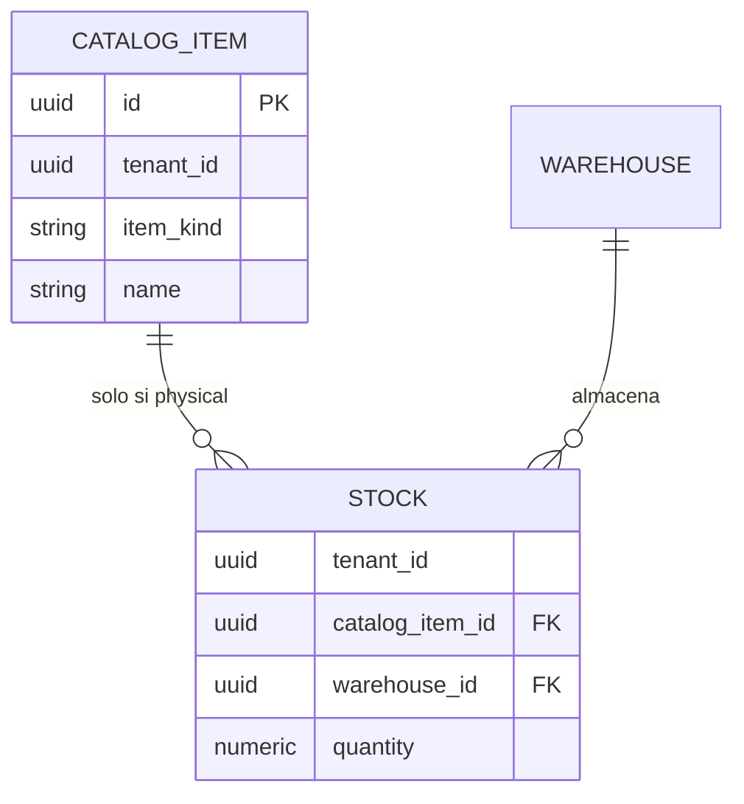

# Catálogo vs Inventario — arquitectura y planes SaaS

> 💡 **Regla de oro:** el **Catálogo** responde *qué* existe; el **Inventario** responde *cuánto* hay y *dónde*. El inventario **nunca** existe sin un ítem de catálogo previo, y **solo** los ítems **físicos** pueden tener stock.

ADR formales: [`adr/009-catalog-inventory-separation.md`](adr/009-catalog-inventory-separation.md) · [`adr/010-inventory-kardex-documents-transit.md`](adr/010-inventory-kardex-documents-transit.md).

---

## 1. Arquitectura de datos

### 1.1 Catálogo (maestro — independiente)

| Aspecto | Decisión |
|---------|----------|
| Bounded context | **Catalog** |
| Responsabilidad | Definir ítems vendibles / facturables / referenciables |
| Tipos de ítem | `physical`, `service` (`CatalogItemKind`) |
| Ejemplos físicos | Microcontroladores, monitores, cables |
| Ejemplos servicio | Mantenimiento preventivo, diagnóstico de red, instalación |
| Dependencias | Ninguna hacia Inventory o Warehousing |
| Esquema PostgreSQL (objetivo) | `catalog.catalog_items`, `catalog.categories` |

Un servicio **no** tiene SKU de bodega ni variantes con stock; puede tener precio, duración estimada y categoría propia.

### 1.2 Inventario (transaccional — dependiente)

| Aspecto | Decisión |
|---------|----------|
| Bounded context | **Inventory** (+ **Warehousing** para ubicación) |
| Responsabilidad | Existencias (`Stock`) y movimientos (`InventoryMovement`) |
| FK obligatoria | `catalog_item_id` → `catalog.catalog_items.id` |
| Restricción | `catalog_items.item_kind = 'physical'` |
| Violación | Rechazar en dominio con `catalog.item.not_stockable` |



### 1.3 Flujo típico

1. **Empresa de servicios:** crea ítems `service` en Catálogo → factura (`invoicing`) → **sin** paso por Inventario.
2. **Retail / bodega:** crea ítems `physical` en Catálogo → recibe stock en bodega (`inventory` + `warehousing`) → movimientos y alertas.

---

## 2. Planes SaaS (monetización)

Matriz **objetivo** alineada a la cartera actual ([`02-planes-y-precios-ecuador.md`](platform-licensing/02-planes-y-precios-ecuador.md)):

| Plan | Código | Segmento | Módulos (`enabled_modules`) | Catálogo | Inventario / bodega |
|------|--------|----------|------------------------------|----------|---------------------|
| **Servicios Básico** | `services-starter` | Empresas de servicio (S1) | `identity`, `catalog` | Solo ítems **service** | ❌ |
| **Starter Cloud** | `starter-cloud` | PyME retail / taller pequeño | `identity`, `catalog`, `inventory`, `warehousing` | Físico + servicio | ✅ |
| **Business Cloud** | `business-cloud` | S1/S2 completo | + `invoicing` | Completo | ✅ |
| **Retail Edge** | `retail-edge` | S2 híbrido | = Business | Completo | ✅ |
| **Multi Empresa** | `multi-empresa` | Holding | = Business | Completo | ✅ |
| **Multi Empresa Plus** | `multi-empresa-plus` | Holding grande | = Business | Completo | ✅ |
| **Enterprise On-Prem** | `enterprise-onprem` | S4 | A la carta | Configurable | Configurable |

### 2.1 Plan Servicios Básico (`services-starter`)

- **Para quién:** consultoras IT, soporte técnico, mantenimiento, servicios profesionales sin almacén.
- **Qué compran:** directorio de clientes internos, catálogo de servicios, usuarios/roles.
- **Qué no compran:** stock, bodegas, movimientos.
- **Restricción técnica:** setting de tenant/plan `catalog.allowed_item_kinds = ["service"]` (ver §3).

### 2.2 Corrección Starter Cloud

El seed histórico omitía `catalog` en `starter-cloud`. Es **inconsistente** con la FK inventario→catálogo. El estado objetivo incluye **`catalog`** en Starter.

> ⚠️ **Deuda:** bases de desarrollo ya sembradas conservan el JSON antiguo hasta re-seed o migración de datos en `licensing.plans`.

### 2.3 Precio orientativo (nuevo plan)

| Plan | USD/mes sugerido | Notas |
|------|------------------|-------|
| `services-starter` | 19–24 | Por debajo de Starter Cloud; sin costo de módulos stock |

(Ajustar en [`02-planes-y-precios-ecuador.md`](platform-licensing/02-planes-y-precios-ecuador.md).)

---

## 3. RBAC y ABAC en `ecunexo_api`

Tres capas complementarias (no sustitutivas):

```
Petición HTTP
    │
    ▼
[1] Módulo contratado ── IModuleEntitlementGuard
    │   enabled_modules ⊇ módulo del permiso (PermissionModuleMapper)
    ▼
[2] RBAC ── roles → permisos (identity.*)
    ▼
[3] ABAC ── Policy.Condition + reglas de plan (settings / resource)
    ▼
  Permitido / 403
```

### 3.1 Capa 1 — Entitlement por módulo (implementado)

- Código: `ModuleEntitlementGuard`, `PermissionModuleMapper`, ADR-006.
- Ejemplo: permiso `inventory.stock.read` → módulo `inventory`. Si la licencia no incluye `inventory`, **403** `module.not_entitled`.
- Plan `services-starter` **no** incluye `inventory` → todos los permisos `inventory.*` y `warehousing.*` bloqueados en macro.

### 3.2 Capa 2 — RBAC (implementado)

- Catálogo global `identity.permissions`; roles por tenant.
- Permisos objetivo (referencia):

| Prefijo | Módulo | Ejemplos |
|---------|--------|----------|
| `catalog.item.*` | catalog | `catalog.item.read`, `catalog.item.create`, `catalog.item.update` |
| `inventory.*` | inventory | `inventory.stock.read`, `inventory.movement.create` |
| `warehousing.*` | warehousing | `warehousing.warehouse.manage` |
| `facturacion.*` | invoicing | Emisión documentos (prefijo histórico API) |

- Al provisionar empresa: `ModulePermissionFilter` asigna al Administrador solo permisos cuyo módulo esté en la licencia.

### 3.3 Capa 3 — ABAC y settings de plan (diseño / parcial)

**Settings en cascada** (resolver futuro `ISettingsResolver`, skill `ecunexo-platform-roadmap`):

| Clave | Valores | Efecto |
|-------|---------|--------|
| `catalog.allowed_item_kinds` | `["service"]` \| `["physical","service"]` | Limita `item_kind` al crear/editar ítems |
| `catalog.require_sku` | `true` / `false` | SKU obligatorio solo para físicos |

**Políticas ABAC** (`identity.policies`, doc **12**):

| Permiso | Condición ejemplo | Plan |
|---------|-------------------|------|
| `catalog.item.create` | `resource.ItemKind == "service"` | services-starter |
| `catalog.item.create` | `true` (sin policy extra) | business-cloud |
| `inventory.movement.create` | Deny si `tenant.HasModule("inventory") == false` | Redundante con capa 1; útil defensa en profundidad |

**Contexto de evaluación** (`PolicyEvaluationContext`): incluir `ResourceItemKind`, `TenantEnabledModules`, `SettingCatalogAllowedKinds` cuando exista el agregado Catalog.

### 3.4 Menú SPA

- Ítems con `requiredModule: "inventory"` ocultos si el tenant no tiene el módulo.
- Sección Catálogo visible con solo `catalog`; formulario de ítem filtra tipos según `catalog.allowed_item_kinds`.

---

## 4. Implementación — estado actual vs objetivo

| Pieza | Estado |
|-------|--------|
| `TenantModuleCodes` (`catalog`, `inventory`, …) | ✅ Core |
| `ModuleEntitlementGuard` | ✅ Business |
| `PermissionModuleMapper` | ✅ Business |
| ABAC `Policy` + `IPermissionAccessGuard` | ✅ Identity |
| Entidad `CatalogItem` + `item_kind` | ✅ Core + schema `catalog` |
| FK `Stock` → `catalog_item_id` | ✅ |
| Kárdex append-only + docs + tránsito (ADR-010) | ✅ (transferencias; ajustes/alertas pendientes) |
| Plan `services-starter` en platform | ✅ Seed licensing |
| `catalog.allowed_item_kinds` en settings | ✅ |
| API Catalog / Inventory | ✅ |
| `ProductVariant` | ⏸ Diferido fase 5 (ADR-010) |

---

## 5. Checklist para nuevas features

Al implementar Catalog o Inventory:

- [ ] Command de inventario valida `item_kind == physical` antes de persistir.
- [ ] Endpoint de catálogo valida `allowed_item_kinds` del tenant.
- [ ] Permiso nuevo usa prefijo = módulo de `TenantModuleCodes`.
- [ ] Entrada de menú declara `requiredModule`.
- [ ] Emisión de licencia en platform refleja módulos del plan (doc **07**).

---

## Enlaces

- [ADR-009](adr/009-catalog-inventory-separation.md) · [ADR-010](adr/010-inventory-kardex-documents-transit.md)
- [`07-mapeo-modulos-permisos.md`](platform-licensing/07-mapeo-modulos-permisos.md)
- [`02-planes-y-precios-ecuador.md`](platform-licensing/02-planes-y-precios-ecuador.md)
- [`11-identity-multitenant-rbac.md`](11-identity-multitenant-rbac.md)
- [`12-policy-abac-fundamentos.md`](12-policy-abac-fundamentos.md)
- `.cursor/skills/ecunexo-architecture/reference-bounded-contexts.md`
