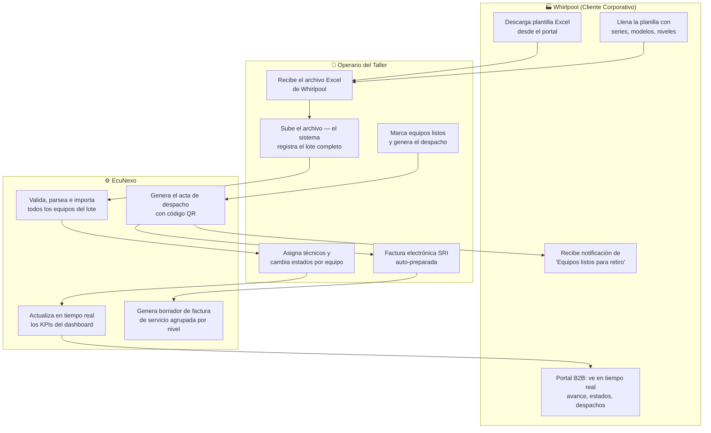
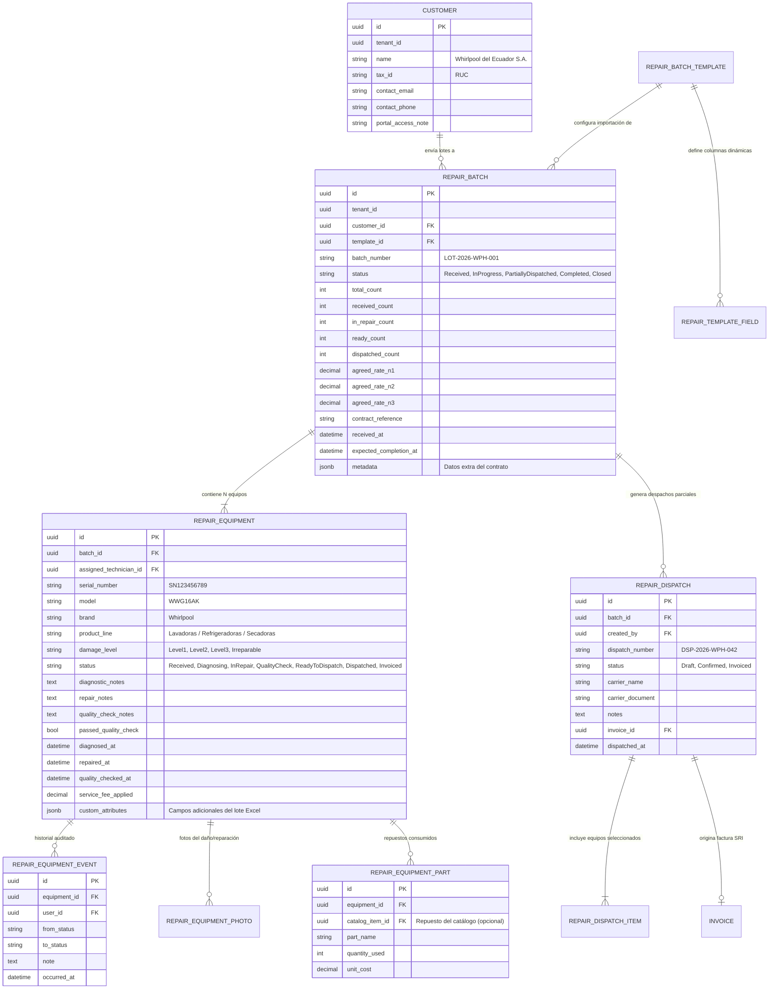
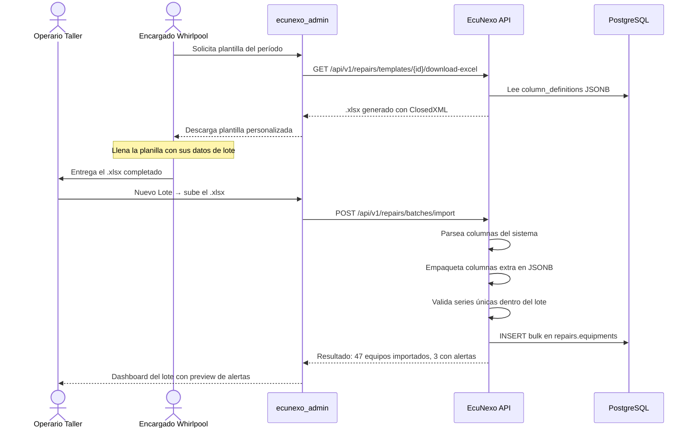
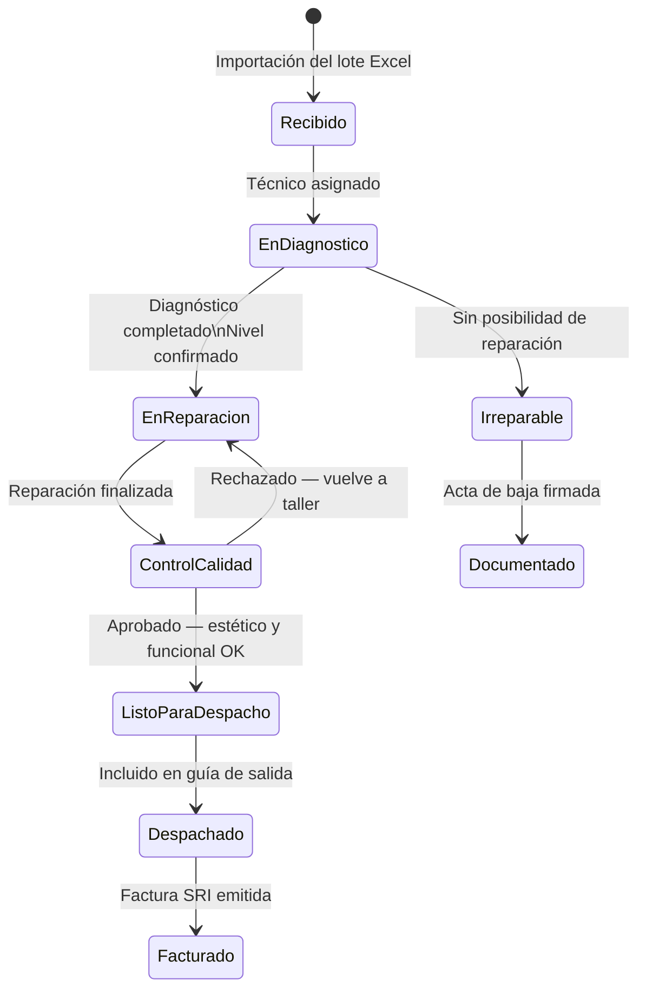
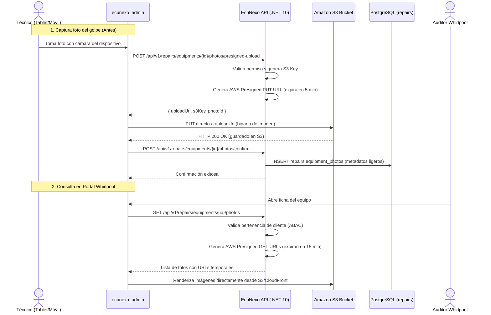
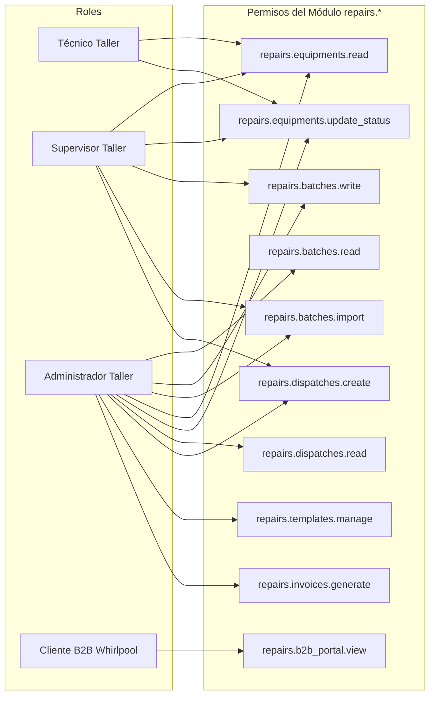
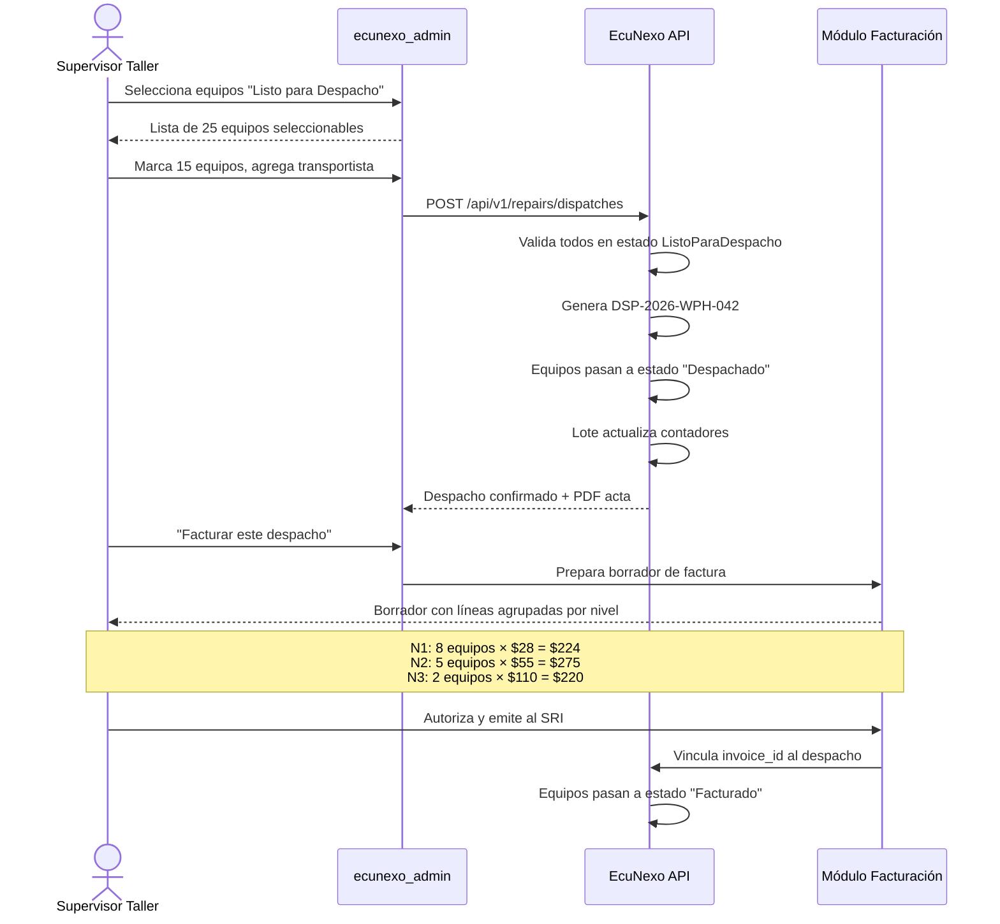
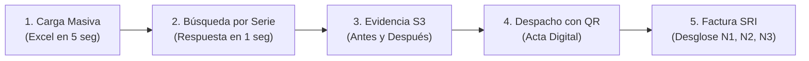

# 17 — Módulo Taller: Reparaciones por Lotes B2B

> **Propósito:** Digitalizar completamente el ciclo de vida de los equipos que un fabricante aliado (Whirlpool, Mabe, LG, etc.) entrega al taller bajo contrato de reacondicionamiento. Desde la recepción del lote hasta la factura electrónica SRI, con un **portal exclusivo de visibilidad en tiempo real para el cliente corporativo** que diferencia este sistema de una planilla de Excel ordinaria.

---

## 1. Propuesta de Valor — ¿Por qué Whirlpool debería querer esto?

Hoy la gestión típica de un contrato de reparación masiva vive entre:
- Correos con adjuntos de Excel.
- WhatsApp con fotos del estado de los equipos.
- Llamadas para saber cuántas lavadoras ya están listas.
- Facturas manuales al cierre del mes sin trazabilidad por equipo.

**Lo que este módulo les ofrece:**

| Problema hoy | Solución con EcuNexo Taller |
|---|---|
| "No sé cuántos de mis equipos ya están reparados" | Dashboard en tiempo real con semáforos de avance por lote |
| "Perdemos track del número de serie de cada equipo" | Registro de serie y modelo desde el ingreso del lote, buscable en segundos |
| "El taller me entrega la factura al final del mes sin desglose" | Factura detallada por nivel de daño y número de serie, vinculada a cada despacho |
| "Si el taller cambia de software pierdo el historial" | Historial permanente auditado por equipo con fecha de cada cambio de estado |
| "No sé cuándo salen mis equipos para coordinar el transporte" | Notificación y acta de despacho con listado de series listos para retiro |
| "Cada lote tiene campos distintos que el sistema no acepta" | Plantilla Excel dinámica generada desde el sistema, adaptada al contrato activo |

---

## 2. Arquitectura de Negocio: Flujo Completo



---

## 3. Modelo de Dominio Completo

### 3.1 Bounded Context `Repairs`

Se desacopla de `Catalog` e `Inventory` — los equipos recibidos son **activos de terceros bajo custodia temporal**, no stock propio del taller.



### 3.2 Tablas de soporte PostgreSQL

```sql
-- Esquema: repairs

CREATE TABLE repairs.customers (
    id UUID PRIMARY KEY DEFAULT gen_random_uuid(),
    tenant_id UUID NOT NULL,
    name TEXT NOT NULL,
    tax_id TEXT,
    contact_email TEXT,
    created_at TIMESTAMPTZ DEFAULT now()
);

CREATE TABLE repairs.batch_templates (
    id UUID PRIMARY KEY DEFAULT gen_random_uuid(),
    tenant_id UUID NOT NULL,
    customer_id UUID REFERENCES repairs.customers(id),
    name TEXT NOT NULL,
    column_definitions JSONB NOT NULL DEFAULT '{"columns": []}',
    is_active BOOLEAN NOT NULL DEFAULT true,
    created_at TIMESTAMPTZ DEFAULT now()
);

CREATE TABLE repairs.batches (
    id UUID PRIMARY KEY DEFAULT gen_random_uuid(),
    tenant_id UUID NOT NULL,
    customer_id UUID NOT NULL REFERENCES repairs.customers(id),
    template_id UUID REFERENCES repairs.batch_templates(id),
    batch_number TEXT NOT NULL,
    status TEXT NOT NULL DEFAULT 'Received',
    total_count INTEGER NOT NULL DEFAULT 0,
    received_count INTEGER NOT NULL DEFAULT 0,
    in_repair_count INTEGER NOT NULL DEFAULT 0,
    ready_count INTEGER NOT NULL DEFAULT 0,
    dispatched_count INTEGER NOT NULL DEFAULT 0,
    agreed_rate_n1 NUMERIC(10,2),
    agreed_rate_n2 NUMERIC(10,2),
    agreed_rate_n3 NUMERIC(10,2),
    contract_reference TEXT,
    expected_completion_at TIMESTAMPTZ,
    received_at TIMESTAMPTZ NOT NULL DEFAULT now(),
    metadata JSONB DEFAULT '{}'
);

CREATE TABLE repairs.equipments (
    id UUID PRIMARY KEY DEFAULT gen_random_uuid(),
    batch_id UUID NOT NULL REFERENCES repairs.batches(id),
    assigned_technician_id UUID,
    serial_number TEXT NOT NULL,
    model TEXT,
    brand TEXT,
    product_line TEXT,
    damage_level TEXT NOT NULL,
    status TEXT NOT NULL DEFAULT 'Received',
    diagnostic_notes TEXT,
    repair_notes TEXT,
    quality_check_notes TEXT,
    passed_quality_check BOOLEAN,
    diagnosed_at TIMESTAMPTZ,
    repaired_at TIMESTAMPTZ,
    quality_checked_at TIMESTAMPTZ,
    service_fee_applied NUMERIC(10,2),
    custom_attributes JSONB DEFAULT '{}',
    created_at TIMESTAMPTZ DEFAULT now()
);

-- Evidencia Fotográfica en Amazon S3 (CERO blobs en BD ni en disco local)
CREATE TABLE repairs.equipment_photos (
    id UUID PRIMARY KEY DEFAULT gen_random_uuid(),
    equipment_id UUID NOT NULL REFERENCES repairs.equipments(id) ON DELETE CASCADE,
    uploaded_by UUID,
    stage TEXT NOT NULL, -- 'DamageInitial', 'QualityFinal', 'InRepair'
    s3_bucket TEXT NOT NULL,
    s3_key TEXT NOT NULL,
    file_name TEXT NOT NULL,
    content_type TEXT NOT NULL DEFAULT 'image/webp',
    file_size_bytes BIGINT NOT NULL,
    caption TEXT,
    captured_at TIMESTAMPTZ NOT NULL DEFAULT now(),
    created_at TIMESTAMPTZ NOT NULL DEFAULT now()
);

CREATE TABLE repairs.dispatches (
    id UUID PRIMARY KEY DEFAULT gen_random_uuid(),
    tenant_id UUID NOT NULL,
    batch_id UUID NOT NULL REFERENCES repairs.batches(id),
    created_by UUID,
    dispatch_number TEXT NOT NULL,
    status TEXT NOT NULL DEFAULT 'Draft', -- 'Draft', 'Confirmed', 'Invoiced'
    carrier_name TEXT,
    carrier_document TEXT,
    verification_hash TEXT NOT NULL UNIQUE, -- Hash público para validar autenticidad con código QR
    qr_code_url TEXT,
    notes TEXT,
    invoice_id UUID,
    dispatched_at TIMESTAMPTZ,
    created_at TIMESTAMPTZ DEFAULT now()
);

CREATE TABLE repairs.dispatch_items (
    id UUID PRIMARY KEY DEFAULT gen_random_uuid(),
    dispatch_id UUID NOT NULL REFERENCES repairs.dispatches(id) ON DELETE CASCADE,
    equipment_id UUID NOT NULL REFERENCES repairs.equipments(id),
    created_at TIMESTAMPTZ DEFAULT now(),
    CONSTRAINT uq_dispatch_equipment UNIQUE (dispatch_id, equipment_id)
);

-- Índices GIN y operacionales
CREATE INDEX idx_equipments_custom_attrs ON repairs.equipments USING gin(custom_attributes);
CREATE INDEX idx_equipments_serial ON repairs.equipments (serial_number);
CREATE INDEX idx_equipments_batch ON repairs.equipments (batch_id);
CREATE INDEX idx_equipments_status ON repairs.equipments (status);
CREATE INDEX idx_equipment_photos_eq ON repairs.equipment_photos (equipment_id);
CREATE INDEX idx_dispatches_batch ON repairs.dispatches (batch_id);
CREATE INDEX idx_dispatches_hash ON repairs.dispatches (verification_hash);
```

> 🛡️ **Principio de Almacenamiento Cero-Blob:**  
> Las imágenes **NUNCA** se almacenan en la base de datos PostgreSQL (ni en columnas `BYTEA` ni como cadenas base64 en `JSONB`), ni se guardan en el sistema de archivos del servidor local. Toda evidencia fotográfica se almacena exclusivamente en **Amazon S3 Buckets**. La base de datos solo almacena metadatos ligeros (`s3_key`, `s3_bucket`, `stage`, tamaño y marcas de tiempo). La transferencia de imágenes se realiza mediante **URLs prefirmadas (Presigned URLs)** con caducidad temporal para subida y descarga directa.

---

## 4. Generador Dinámico de Plantillas Excel

### 4.1 Filosofía del Diseño

Cada lote de Whirlpool puede llegar con columnas ligeramente distintas. Hay campos que **siempre estarán** (el sistema los llama `is_system_field: true`) y campos que **dependen del contrato o lote** (ej. "Pallet de Origen", "Código de Centro de Costos Whirlpool", "Número de Guía de Transporte Interno"). Ambos tipos coexisten sin riesgo de errores.

### 4.2 Estructura JSONB de `column_definitions`

```json
{
  "version": "1.0",
  "customer": "Whirlpool",
  "columns": [
    {
      "order": 1,
      "key": "serial_number",
      "label": "Número de Serie",
      "type": "string",
      "required": true,
      "is_system_field": true,
      "validation": { "min_length": 5, "max_length": 30, "unique_in_batch": true },
      "example": "SN123456789"
    },
    {
      "order": 2,
      "key": "model",
      "label": "Modelo",
      "type": "string",
      "required": true,
      "is_system_field": true,
      "example": "WWG16AK"
    },
    {
      "order": 3,
      "key": "product_line",
      "label": "Línea de Producto",
      "type": "select",
      "required": true,
      "is_system_field": true,
      "options": ["Lavadora", "Refrigeradora", "Secadora", "Lavavajillas", "Microondas"],
      "example": "Lavadora"
    },
    {
      "order": 4,
      "key": "damage_level",
      "label": "Nivel de Golpe",
      "type": "select",
      "required": true,
      "is_system_field": true,
      "options": ["Nivel 1 — Estético", "Nivel 2 — Chapa y Mecánica", "Nivel 3 — Estructural"],
      "example": "Nivel 1 — Estético"
    },
    {
      "order": 5,
      "key": "damaged_component",
      "label": "Parte Afectada Principal",
      "type": "select",
      "required": false,
      "is_system_field": false,
      "options": ["Panel frontal", "Puerta / Tapa", "Panel lateral", "Panel trasero", "Marco interior", "Tina / Tambor", "Base / Patas", "Panel de control"],
      "example": "Panel frontal"
    },
    {
      "order": 6,
      "key": "pallet_code",
      "label": "Código de Pallet",
      "type": "string",
      "required": false,
      "is_system_field": false,
      "example": "PLT-0042-A"
    },
    {
      "order": 7,
      "key": "origin_guide",
      "label": "N° Guía de Remisión Origen",
      "type": "string",
      "required": false,
      "is_system_field": false,
      "example": "GR-2026-00871"
    },
    {
      "order": 8,
      "key": "cost_center",
      "label": "Centro de Costos Whirlpool",
      "type": "string",
      "required": false,
      "is_system_field": false,
      "example": "CC-DIS-GYE"
    },
    {
      "order": 9,
      "key": "origin_warehouse",
      "label": "Bodega de Origen Whirlpool",
      "type": "string",
      "required": false,
      "is_system_field": false,
      "example": "CEDI Guayaquil"
    },
    {
      "order": 10,
      "key": "origin_notes",
      "label": "Observación del Despachador",
      "type": "text",
      "required": false,
      "is_system_field": false,
      "example": "Golpe lateral producido en carga de contenedor"
    }
  ]
}
```

### 4.3 Flujo de Generación e Importación



### 4.4 Reglas de Validación en la Importación

| Validación | Acción del Sistema |
|---|---|
| Número de serie duplicado **dentro del lote** | Error: detiene la fila, reporta conflicto |
| Número de serie ya existe **en otro lote activo** | Advertencia: permite continuar pero marca el equipo |
| Nivel de golpe no reconocido | Error: fila rechazada, muestra valores válidos esperados |
| Modelo no está en el catálogo de Whirlpool | Advertencia: permite importar, registra para revisión |
| Columnas extras no definidas en la plantilla | Aceptadas y guardadas en `custom_attributes` sin error |
| Columnas requeridas vacías | Error: informa exactamente qué filas y columnas tienen el problema |

---

## 5. Clasificación de Niveles de Daño — Definición Operativa

### 5.1 Matriz de Niveles con Tiempos y Recursos

| Nivel | Nombre Operativo | Descripción Técnica | Tiempo Est. Técnico | Repuestos Típicos |
|---|---|---|---|---|
| **N1** | Estético / Cosmético | Golpes superficiales en paneles externos. Sin afectación mecánica ni eléctrica. Requiere: pulido, desabollado en frío, retoque de esmalte, limpieza de bordes. | 1.5 — 3 horas | Esmalte, pasta de pulir, protectores de bordes |
| **N2** | Gabinete y Mecánica Externa | Deformación que requiere desmontaje: rectificación de paneles estructurales, reemplazo de bisagras, tapas, manijas, patas, perillas. Afectación estética importante pero funcionalidad conservada. | 3 — 6 horas | Bisagras, tapas, manijas, set de patas, juntas |
| **N3** | Estructural y Funcional | Daño en chasis portante, cuba o tambor, motor, arnés eléctrico o tarjeta electrónica. Requiere pruebas de aislamiento eléctrico y ensayo de funcionamiento completo. | 6 — 16 horas | Motor, tambor, tarjeta electrónica, arnés |
| **IRRE** | Irreparable | Daño estructural total. El equipo no puede recuperarse económicamente. Se documenta para seguro / baja contable de Whirlpool. | — | — |

### 5.2 Máquina de Estados por Equipo



### 5.3 Registro de Eventos (Bitácora Auditada)

Cada cambio de estado genera un evento inmutable en `repairs.equipment_events`:

```
2026-09-10 08:15 | CARLOS ANDRADE | Recibido → En Diagnóstico
    Nota: "Equipo ingresa con golpe visible en panel frontal derecho. Bisagra de tapa desalineada."

2026-09-10 10:30 | CARLOS ANDRADE | En Diagnóstico → En Reparación
    Nota: "Confirmado Nivel 2. Se solicita bisagra WPL-BIS-001 a bodega."

2026-09-10 14:45 | CARLOS ANDRADE | En Reparación → Control de Calidad
    Nota: "Panel rectificado y bisagra reemplazada. Prueba de apertura y cierre OK."

2026-09-10 15:10 | ANDREA REYES  | Control de Calidad → Listo para Despacho
    Nota: "Aprobado. Prueba de funcionamiento completo y estética satisfactoria."
```

Este historial completo es visible para el usuario de Whirlpool en su portal B2B.

### 5.4 Evidencia Fotográfica en la Nube con Amazon S3 (Antes & Después)

> ⚠️ **Regla de Arquitectura Estricta:** Las fotos **bajo ningún concepto se guardan en la base de datos PostgreSQL** (no usar `BYTEA` ni cadenas en base64) **ni en el sistema de archivos del servidor**. El almacenamiento es 100% externo en **Amazon S3 Buckets**.

#### 1. Justificación Técnica y de Costos
- **Salud de la base de datos:** Un lote de 100 lavadoras con 3 fotos por equipo (a 3 MB cada una) generaría ~1 GB de datos binarios por lote. Guardar esto en PostgreSQL inflaría los backups diarios, degradaría los índices y colapsaría la memoria RAM de la base de datos.
- **Cero carga de I/O en el servidor:** El servidor API **nunca** recibe los streams de bytes de las imágenes; genera **URLs prefirmadas (Presigned URLs)** para que el navegador o la tablet del técnico suba la foto directamente a Amazon S3.

#### 2. Estructura de Claves (S3 Keys)
Los objetos se organizan con prefijos jerárquicos multitenant seguros:
```
s3://ecunexo-repairs-evidence-{env}/
   └── tenants/{tenantId}/
       └── batches/{batchId}/
           └── equipments/{serialNumber}/
               ├── damage_initial_{photoId}_{timestamp}.webp
               └── quality_final_{photoId}_{timestamp}.webp
```

#### 3. Flujo Operativo de Carga y Visualización con Presigned URLs



#### 4. Casos de Uso Críticos para Whirlpool
- **`DamageInitial` (Evidencia para Aseguradora):** Captura el golpe exacto tal como llegó el electrodoméstico del transporte marítimo/terrestre (panel doblado, esmalte saltado, chasis descuadrado). Whirlpool puede descargar el reporte con estas fotos para justificar y cobrar su póliza de seguro de transporte de inmediato.
- **`QualityFinal` (Certificación de Entrega):** Foto del equipo terminado, reacondicionado, pulido y embalado. Certifica ante Whirlpool que el equipo salió impecable del taller, blindando al taller contra reclamos infundados de transporte posterior.

---

## 6. Portal del Cliente Corporativo (Whirlpool B2B)

### 6.1 Experiencia de Usuario en el Portal

El usuario que Whirlpool recibe no ve el sistema completo de EcuNexo. Entra a una **vista ejecutiva y limpia** diseñada específicamente para su rol:

**Página Principal del Portal:**
```
╔══════════════════════════════════════════════════════════════════╗
║  Whirlpool del Ecuador — Portal de Reparaciones           v0.7.0 ║
╠══════════════════════════════════════════════════════════════════╣
║                                                                  ║
║  📦 Lotes Activos         🔧 Equipos en Proceso   ✅ Listos hoy  ║
║       4                         87                    15         ║
║                                                                  ║
║  ─────────────────────────────────────────────────────────────── ║
║  LOTE                  ESTADO         AVANCE     DESPACHOS       ║
║  LOT-2026-WPH-001     En proceso    ████░░ 73%   1 realizado     ║
║  LOT-2026-WPH-002     Recibido      █░░░░░ 10%   —              ║
║  LOT-2026-WPH-003     Completado    ██████ 100%  2 realizados    ║
║  LOT-2026-WPH-004     En proceso    ███░░░ 52%   1 realizado     ║
║                                                                  ║
║  🔍 Buscar por número de serie...  [__________________] [Buscar] ║
╚══════════════════════════════════════════════════════════════════╝
```

**Vista de un Equipo Individual:**
```
╔══════════════════════════════════════════════════════════════════╗
║  Serie: SN123456789 — Lavadora Whirlpool WWG16AK                 ║
╠══════════════════════════════════════════════════════════════════╣
║  Estado actual:  🔧 En Reparación (Nivel 2)                      ║
║  Técnico:        Carlos Andrade                                  ║
║  Lote origen:    LOT-2026-WPH-001                               ║
║  Ingresó:        2026-09-05                                      ║
╠══════════════════════════════════════════════════════════════════╣
║  HISTORIAL                                                       ║
║  09-05 08:15  Recibido en taller                                 ║
║  09-10 08:15  Asignado a diagnóstico — Carlos Andrade            ║
║  09-10 10:30  En reparación — Nivel 2 confirmado                 ║
╚══════════════════════════════════════════════════════════════════╝
```

### 6.2 Modelo de Seguridad RBAC + ABAC



**Regla ABAC crítica para el usuario B2B (en backend):**
```csharp
// RepairBatchQueryService.cs
public IQueryable<RepairBatch> ApplyClientFilter(IQueryable<RepairBatch> query, UserContext user)
{
    // Regla de aislamiento multi-cliente: el usuario B2B
    // SOLO ve lotes donde su empresa es el cliente registrado.
    if (user.HasRole("taller.cliente_b2b"))
    {
        var assignedCustomerId = user.Claims["assigned_customer_id"];
        query = query.Where(b => b.CustomerId == Guid.Parse(assignedCustomerId));
    }
    return query;
}
```

---

## 7. KPIs y Reportes Gerenciales

### 7.1 KPIs para el Dashboard del Operador (Taller)

| Métrica | Cálculo | Alerta |
|---|---|---|
| **Equipos en espera de asignación** | `status = Received` sin técnico asignado | > 20 equipos sin asignar |
| **Tiempo promedio de diagnóstico** | `diagnosed_at - received_at` por lote | > 48h promedio |
| **Tiempo promedio de reparación** | `repaired_at - diagnosed_at` por nivel | N1>1d, N2>3d, N3>7d |
| **Tasa de rechazo en control de calidad** | `rechazados / total_en_CQ` (%) | > 15% de rechazos |
| **Equipos Nivel 3 sin asignar** | `damage_level=Level3 AND status=Received` | > 5 equipos N3 sin atender |
| **Tasa de Irreparables por lote** | `irreparable_count / total_count` | > 10% irreparables |

### 7.2 KPIs para el Portal Whirlpool

| Métrica | Descripción |
|---|---|
| **Equipos por estado** | Barras por `Recibido / Diagnóstico / Reparación / Listo / Despachado` |
| **Avance del lote (%)** | `(dispatched + ready) / total * 100` |
| **Tiempo restante estimado** | Calculado vs `expected_completion_at` del lote |
| **Valor acumulado de servicio** | `SUM(service_fee_applied)` por lote — previsualización de la factura |
| **Despachos realizados** | Listado histórico de actas con sus series entregadas |

### 7.3 Reporte Exportable para Whirlpool

Disponible desde el portal B2B: botón **"Descargar Reporte de Lote"** genera un Excel estructurado con:
- Hoja 1: Resumen ejecutivo del lote (totales por estado y nivel).
- Hoja 2: Detalle por equipo (serie, modelo, nivel, estado actual, técnico, fechas de cambio, notas).
- Hoja 3: Historial de despachos con series incluidas en cada salida.

---

## 8. Despachos Parciales y Facturación SRI

### 8.1 Flujo de Despacho



### 8.2 Estructura de la Factura de Servicio Generada

```
FACTURA ELECTRÓNICA No. 001-001-000000312
─────────────────────────────────────────────────────────
CLIENTE: Whirlpool del Ecuador S.A.
RUC: 0992345671001
REFERENCIA: Despacho DSP-2026-WPH-042 / Lote LOT-2026-WPH-001

CONCEPTO                                CANT.  V.UNIT.   SUBTOTAL
─────────────────────────────────────────────────────────
Servicio Reacondicionamiento Nivel 1      8     $28.00    $224.00
Servicio Reacondicionamiento Nivel 2      5     $55.00    $275.00
Servicio Reacondicionamiento Nivel 3      2    $110.00    $220.00
─────────────────────────────────────────────────────────
                              SUBTOTAL          $719.00
                              IVA (15%)         $107.85
                              TOTAL             $826.85
─────────────────────────────────────────────────────────
Series incluidas: SN001, SN002, SN003 ... (ver detalle adjunto)
Clave de acceso SRI: 1009202601179234567010011000000312...
```

### 8.3 Acta de Despacho Digital con Código QR de Verificación

Cada salida genera automáticamente un documento formal en PDF:
- **Encabezado Institucional:** Datos del Taller, RUC, datos de Whirlpool del Ecuador y número de despacho oficial (`DSP-2026-WPH-042`).
- **Código QR Dinámico:**
  - Codifica una URL segura: `https://app.ecunexo.com/verify/dispatch/{verification_hash}`.
  - Al ser escaneado por el chofer del camión, el guardia de garita o el auditor de Whirlpool en destino, abre una página pública responsive con la **autenticidad certificada**: fecha, hora, chofer autorizado, placa del camión y la lista completa de números de serie despachados.
- **Detalle de Equipos:** Tabla con cada número de serie, modelo, nivel de reparación y resultado de control de calidad.
- **Bloque de Firmas:**
  - Firma y sello del Jefe de Taller / Control de Calidad.
  - Firma, cédula y placa del Transportista receptor.

---

## 9. Arquitectura de Endpoints API

```
Bounded context: repairs
Base: /api/v1/repairs

PLANTILLAS
GET    /templates                         → Listar plantillas activas
POST   /templates                         → Crear nueva plantilla
GET    /templates/{id}                    → Detalle de plantilla
PUT    /templates/{id}                    → Actualizar esquema de columnas
GET    /templates/{id}/download-excel     → Generar y descargar .xlsx

LOTES
GET    /batches                           → Listar lotes del tenant (con filtros)
POST   /batches                           → Crear lote vacío
GET    /batches/{id}                      → Detalle de lote + KPIs
POST   /batches/import                    → Importar lote desde .xlsx (multipart)
GET    /batches/{id}/summary              → Resumen ejecutivo exportable

EQUIPOS
GET    /batches/{batchId}/equipments      → Listar equipos del lote
GET    /equipments/{id}                   → Detalle + historial de estados
PATCH  /equipments/{id}/status            → Cambiar estado (con nota y técnico)
GET    /equipments/search?q={serial}      → Búsqueda por número de serie
GET    /equipments/{id}/events            → Bitácora auditada del equipo

EVIDENCIA FOTOGRÁFICA (Amazon S3 — Presigned URLs)
POST   /equipments/{id}/photos/presigned-upload → Obtiene URL temporal PUT para subir a S3
POST   /equipments/{id}/photos/confirm          → Registra metadatos ligeros en BD tras upload a S3
GET    /equipments/{id}/photos                  → Lista fotos con Presigned GET URLs temporales
DELETE /photos/{photoId}                        → Elimina registro y purga objeto en S3

DESPACHOS & VERIFICACIÓN
GET    /dispatches                        → Listar despachos del tenant
POST   /dispatches                        → Crear nuevo despacho (selección de equipos)
GET    /dispatches/{id}                   → Detalle de despacho
GET    /dispatches/{id}/pdf               → Genera Acta Oficial de Entrega en PDF con QR
POST   /dispatches/{id}/invoice           → Generar borrador de factura SRI

VALIDACIÓN PÚBLICA (Escaneo de QR en garita/destino)
GET    /public/verify-dispatch/{hash}     → Consulta anónima de autenticidad del despacho

PORTAL B2B (filtrado automático por cliente)
GET    /portal/batches                    → Solo lotes del cliente autenticado
GET    /portal/equipments/search          → Buscar serie dentro de los lotes propios
GET    /portal/batches/{id}/report        → Exportar reporte Excel del lote

CLIENTES
GET    /customers                         → Listar empresas cliente
POST   /customers                         → Registrar empresa cliente
GET    /customers/{id}                    → Detalle y lotes asociados
```

---

## 10. Plan de Implementación por Fases

| Fase | Alcance | Duración Est. | Entregables |
|---|---|---|---|
| **F1 — Modelo de Datos y Plantillas** | Bounded context `Repairs`, entidades EF Core, migraciones PostgreSQL, tabla de clientes corporativos, generador de Excel con `ClosedXML`. | 1 semana | Migraciones, entidades de dominio, endpoint `download-excel`, unit tests. |
| **F2 — Importación y Pipeline de Reparación** | Parser de Excel con mapeo JSONB, validaciones de series y niveles, cambio de estados con bitácora de eventos auditada. | 1 semana | Endpoints `import`, `update-status`, `events`. Pruebas de integración con Excel real de Whirlpool. |
| **F3 — Frontend Gestión Taller** | DataGrid de lotes, importador drag & drop con reporte de errores en línea, ficha de equipo con historial completo, Kanban de avance por técnico. | 1 semana | Páginas `/taller/lotes`, `/taller/equipos`, `/taller/plantillas`. |
| **F4 — Portal Cliente B2B** | Rol y permisos RBAC/ABAC, filtro por cliente, dashboard ejecutivo con semáforos, buscador por serie, exportación del reporte. | 0.5 semanas | Vista `/taller/portal`, permisos seed, documentación de acceso para Whirlpool. |
| **F5 — Despachos y Facturación SRI** | Despachos parciales/totales, generación de acta PDF con QR, borrador automático de factura de servicios, vinculación bidireccional. | 0.5 semanas | Endpoints de despacho, flujo completo de facturación, PDF de acta. |

**Total estimado: 4 semanas para el módulo completo y funcional.**

---

## 11. Diferenciadores Clave Frente a un Excel Compartido

| Capacidad | Excel/WhatsApp | EcuNexo Taller |
|---|---|---|
| Trazabilidad de cada equipo | ❌ Manual, fácil de perder | ✅ Bitácora automática e inmutable |
| Búsqueda instantánea por serie | ❌ Ctrl+F en un archivo | ✅ Búsqueda global en tiempo real |
| Visibilidad del cliente en tiempo real | ❌ Debe llamar al taller | ✅ Portal propio con acceso 24/7 |
| Prevención de duplicados de series | ❌ Depende del operador | ✅ Validación automática en importación |
| Factura detallada por nivel y serie | ❌ Factura manual al mes | ✅ Generada automáticamente desde el despacho |
| Reporte ejecutivo exportable | ❌ Armar manualmente | ✅ Exportar en 1 clic desde el portal |
| Múltiples clientes corporativos simultáneos | ❌ Un archivo por cliente | ✅ Multi-cliente aislado por ABAC |
| Historial de contratos anteriores | ❌ Se pierde o archiva | ✅ Permanente y auditable en la plataforma |
| Escalabilidad (500 equipos en un lote) | ❌ Excel colapsa | ✅ Importación bulk con validaciones paralelas |
| Evidencia fotográfica de golpes | ❌ Fotos dispersas en chats de WhatsApp | ✅ Almacenadas en Amazon S3, vinculadas a la serie y disponibles para la aseguradora |
| Recepción y despacho de carga | ❌ Hojas de papel que se extravían | ✅ Acta oficial en PDF con código QR de verificación digital |

---

## 12. Estrategia Comercial de Presentación ("El Efecto Demo" para Ganar la Licitación)

Cuando presentes esta propuesta a los directores de Operaciones, Logística o Postventa de Whirlpool, **no abras una presentación de PowerPoint**. Abre directamente el sistema con una demo real configurada con su marca.

### El Guion de Demostración en 5 Pasos:



1. **Paso 1: La Carga Sin Fricción (5 segundos):**
   - *"Miren su propia planilla de Excel con 50 lavadoras que llegaron hoy de bodega. En lugar de tipearlas una a una, la arrastramos al sistema..."*
   - Subes el archivo: el sistema procesa las 50 series, detecta si hay alguna repetida y las clasifica en Nivel 1, Nivel 2 y Nivel 3.
2. **Paso 2: La Búsqueda Instantánea frente al Cliente:**
   - Le pides al gerente de Whirlpool: *"Dígame un número de serie de los que ingresamos"*.
   - Lo escribes en el buscador global y en 1 segundo aparece: en qué estado está, qué técnico lo tiene asignado y qué nivel de daño tiene.
3. **Paso 3: La Evidencia Fotográfica en la Nube (Amazon S3):**
   - Abres la ficha del equipo y muestras:
     - Foto del golpe inicial tal como llegó del camión (para que ellos cobren el seguro de transporte).
     - Foto del equipo terminado y reacondicionado en control de calidad (garantía de entrega perfecta).
   - Les explicas: *"Las fotos no se pierden en chats de WhatsApp; quedan en la nube de Amazon vinculadas al historial permanente de cada electrodoméstico"*.
4. **Paso 4: El Despacho con Verificación QR:**
   - Seleccionas 15 lavadoras listas para salir.
   - Generas el despacho: descargas el PDF oficial con el código QR y le dices al gerente que lo escanee con su propio teléfono móvil.
   - Su teléfono abrirá la pantalla de certificación auténtica con la lista de series que el camión está retirando.
5. **Paso 5: El Argumento de Cierre (La Liquidación Transparente):**
   - Le muestras el borrador de factura electrónica SRI listo para emitir: *8 lavadoras Nivel 1 ($224) + 5 Nivel 2 ($275) + 2 Nivel 3 ($220)*.
   - **Frase de cierre:**  
     > *"Nosotros no les cobramos por darles este portal ni por las cuentas de usuario de sus auditores. Esto es nuestro compromiso de transparencia operativa como su partner tecnológico oficial en Ecuador."*

---

## 13. Puntos Abiertos para Confirmación con Whirlpool

Antes de comenzar la Fase 1, confirmar:

1. **Columnas del archivo estándar de Whirlpool:** ¿Qué campos incluye el Excel que actualmente Whirlpool entrega al taller? (guía de remisión, pallet, código de bodega origen, referencia de seguro, etc.)
2. **Tarifas por nivel de daño:** ¿Están pactadas en el contrato como fijas por nivel ($), o son cotizadas caso a caso? ¿Aplica IVA 15%?
3. **Manejo de repuestos:** ¿El taller consume repuestos propios (se registra egreso de bodega por equipo) o Whirlpool los provee en consignación?
4. **Equipos Irreparables:** ¿Quieren un acta digital firmable (PDF + nombre del representante Whirlpool) que documente la baja contable?
5. **Notificaciones:** ¿El usuario de Whirlpool requiere recibir un correo automático cuando un lote alcanza cierto % de completado o cuando hay equipos listos para retiro?
6. **Múltiples líneas de producto:** ¿El contrato cubre solo lavadoras o incluye refrigeradoras, secadoras, lavavajillas?
