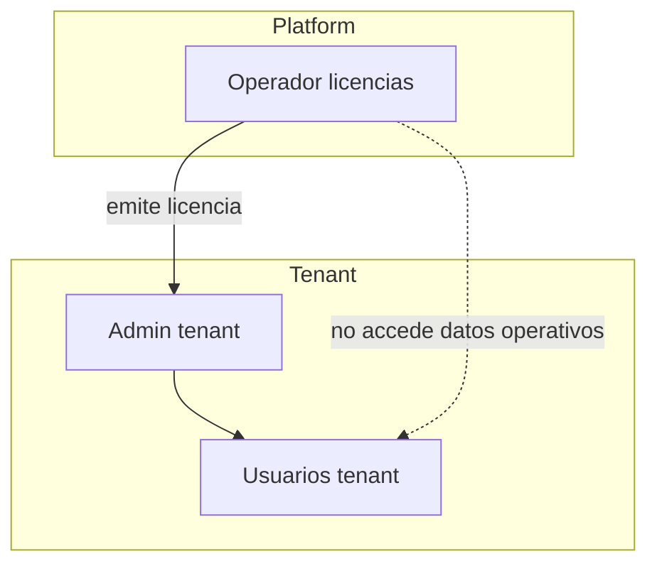

# Jerarquía de usuarios

## Dos planos de identidad (+ suscripción cliente)

### Plano A — Operadores Ecunexo (nuevo)

Viven en esquema **`platform`** (o BD dedicada). **No** tienen `tenant_id`.

| Rol platform | Permisos sugeridos | Puede |
|--------------|-------------------|--------|
| **LicenseViewer** | `platform.licenses.read` | Ver clientes y licencias |
| **LicenseIssuer** | `platform.licenses.issue` | Emitir / revocar códigos |
| **LicenseAdmin** | `platform.licenses.manage` | Planes, clientes, auditoría |
| **PlatformSuperAdmin** | `platform.*` | Crear operadores Ecunexo |

Autenticación: JWT con audiencia `ecunexo-platform` (distinta del tenant).

### Plano C — Titular de licencia (cliente raíz comercial)

Vive en **`tenancy.subscription_accounts`**. Sin `tenant_id` en JWT (`pk=subscription`).

| Rol lógico | Permisos API | Puede |
|------------|--------------|-------|
| **Titular** | `tenancy.tenant.read`, `tenancy.tenants.read`, `tenancy.tenants.create`, `tenancy.tenants.delete` | Ver plan/cupos, listar, crear y eliminar (lógico) empresas; entrar a empresa (si comparte email con admin) |

Menú SPA: contexto **Subscription** (Inicio, Empresas, Plan). Operación de producto (equipo, facturación, etc.) solo tras **entrar a una empresa** (plano B).

Detalle: [[10-modelo-titular-suscripcion-rbac]].

### Plano B — Usuarios del cliente (existente)

Viven en **`identity.users`** con `tenant_id`. Creados por onboarding o invitación.

| Rol tenant | Origen | Permisos |
|------------|--------|----------|
| **Administrador** | Onboarding / provision empresa | Permisos activos **filtrados por módulos de la licencia** |
| Roles custom | Cliente | Subconjunto vía RBAC |

## Generador de usuarios platform (objetivo UI)

Pantalla: **Platform → Operadores → Nuevo operador**

Campos:

- email, nombre
- rol platform (Issuer / Admin)
- activo / revocado
- MFA (fase 2)

> No mezclar con «crear usuario del tenant»: flujos separados en menú.

## Generador vía licencia (cliente final)

| Paso | Actor | Acción |
|------|-------|--------|
| 1 | Operador Ecunexo | Emite licencia (plan + módulos + slots) |
| 2 | Cliente | Canje en `/bienvenida` o instalación on-prem |
| 3 | Sistema | Crea titular (`subscription_accounts`) o tenant+admin (legacy) |

Si el email ya existe en ese tenant → hoy **409**; v2: modo «sincronizar permisos».

## Diagrama

## Enlaces

- [[05-admin-licencias-ui]]
- [[04-api-licencias-diseno]]
