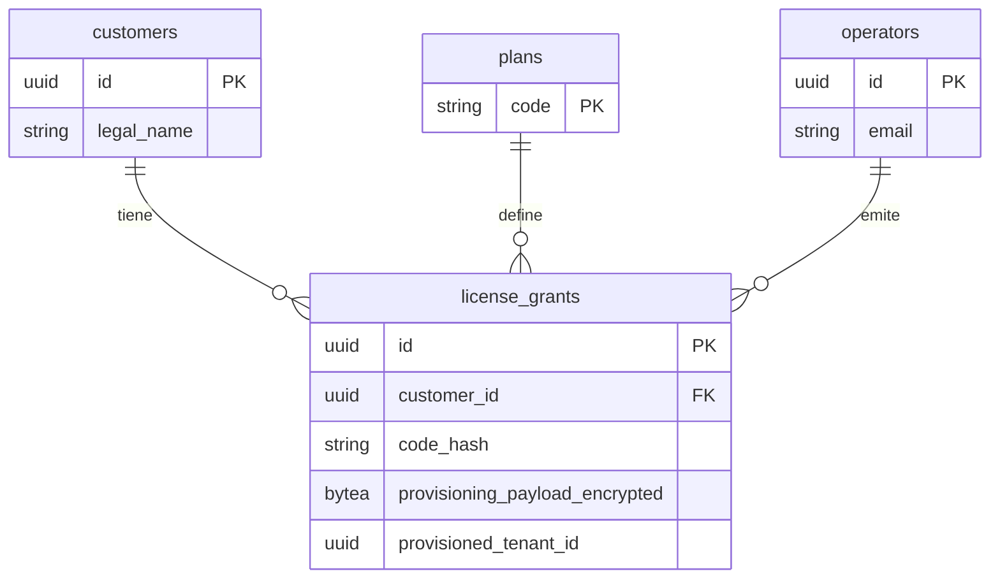

# Plan de tablas — Platform Licensing (v1)

Documento de planificación. Define qué tablas viven en **`licensing_ecunexo`** (BD comercial), qué se **reutiliza** en **`ecunexo`** (BD operativa) y el enlace **lógico** entre ambas (sin FK cross-database).

---

## 1. Principio rector — dos bases de datos

| BD | Esquema | Qué guarda |
|----|---------|------------|
| **`licensing_ecunexo`** | `licensing` | Cliente titular, planes, operadores Ecunexo, grants (hash + payload cifrado) |
| **`ecunexo`** | `tenancy`, `identity`, `platform` | Canje técnico (`activation_codes`), tenants, usuarios, RBAC, `sys_settings` |

La API **Platform** (`ecunexo_license_api`) escribe **solo** en **licensing** (emisión de licencias).  
La API **Tenant** (`ecunexo_api`) **no emite** licencias y **no accede** a `licensing_ecunexo`: valida un **artefacto firmado** + hash de validación y provisiona en **ecunexo**. Si `PlatformApiBaseUrl` está configurada, consulta `GET /licenses/{grantId}/status`.

**No hay FK entre bases**: `license_grants.activation_code_id` es UUID lógico; puede coincidir con `tenancy.activation_codes.id` tras el sync v1.

---

## 2. Tablas en `ecunexo` (reutilizar)

### 2.1 `tenancy.activation_codes` — legacy (solo dev/scripts)

Onboarding legacy (`tenant-with-activation`) y seeds de desarrollo. **No** se escribe al emitir desde Platform.

### 2.2 `platform.sys_settings` — sin cambios

Solo en `ecunexo`. No duplicar en licensing.

### 2.3 `tenancy.subscription_accounts` (implementado)

Titular de licencia en el despliegue cliente. Sin `tenant_id`.

| Columna | Notas |
|---------|--------|
| `id` | uuid PK (también es `subscription_group_id`) |
| `grant_id` | uuid UNIQUE — enlace lógico al grant de platform |
| `email`, `name`, `password_hash` | Credenciales titular |
| `department`, `phone`, `job_title` | Datos de contacto |
| `subscription_max_tenants` | Cupo de empresas bajo esta licencia |
| `enabled_module_codes` | jsonb — lista plana legacy de módulos |
| `module_entitlements` | jsonb — `ModuleEntitlement[]` con tiers y límites |
| `subscription_group_id` | uuid — agrupa `tenants` bajo la misma licencia |
| `plan_name`, `plan_max_users`, `plan_max_warehouses` | Snapshot del plan (via `ServicePlan`) |
| `license_expires_at_utc` | Fin de vigencia comercial |
| `online_validation_interval_days` | Gracia offline (1–90, default 30) |
| `last_online_license_validation_at_utc` | Última validación online exitosa |
| `last_login_at` | Último login del titular |

### 2.4 `tenancy.license_redemptions` (implementado)

Canje local del `grantId`: evita doble activación del mismo grant.

| Columna | Notas |
|---------|--------|
| `id` | uuid PK (= `license_grants.id` lógico; la columna redundante `grant_id` fue eliminada) |
| `subscription_account_id` | uuid FK → `subscription_accounts.id` |
| `redeemed_at_utc` | timestamptz |

### 2.5 `tenancy.tenants` — columnas nuevas

Columnas agregadas al esquema `tenancy.tenants`:

| Columna | Notas |
|---------|--------|
| `subscription_group_id` | uuid — agrupa empresas bajo una licencia |
| `module_entitlements` | jsonb — `ModuleEntitlement[]` con tiers y límites (hereda del titular al provisionar) |

### 2.6 Destino tras provisionar empresa

`tenancy.tenants` (con `subscription_group_id`), `identity.*` — escritura desde `ProvisionSubscriptionCompanyHandler`.

---

## 3. Tablas NUEVAS en `licensing_ecunexo` (esquema `licensing`)

### 3.1 `licensing.customers`

Igual al diseño original (titular comercial): `legal_name`, `tax_id`, `deployment_mode`, `status`, auditoría, `xmin`.

### 3.2 `licensing.plans`

Catálogo (`code` PK, defaults cupos/módulos, `suggested_price_usd_monthly`, seed Ecuador).

### 3.3 `licensing.operators`

Usuarios Ecunexo (email, `password_hash`, `role` enum). Separados de `identity.users`.

### 3.4 `licensing.license_grants`

Emisión comercial **y** datos técnicos del código:

| Columna | Notas |
|---------|--------|
| `id` | uuid PK |
| `customer_id` | FK → `licensing.customers` |
| `plan_code` | FK → `licensing.plans` |
| `activation_code_id` | UUID lógico (sync opcional a `ecunexo`) |
| `code_hash` | Huella SHA-256 + **IssuePepper** (solo emisión; tenant no la conoce) |
| `max_tenants`, `max_users`, `max_warehouses`, `enabled_module_codes`, `expires_at_utc`, `provisioning_slots_remaining` | Snapshot al emitir |
| `provisioning_payload_encrypted` | bytea — JSON cifrado (email, nombre, tenant, contraseña temporal) |
| `provisioned_tenant_id` | uuid null — tenant en `ecunexo` tras primer canje |
| `issued_at_utc`, `issued_by_operator_id`, `deployment_mode`, `validity_days`, `notes`, `status` | Auditoría |
| `revoked_at_utc`, `revoked_by_operator_id` | Revocación |
| `xmin` | Concurrencia |

**No** persistir el código en claro; solo en la respuesta HTTP de emisión.

---

## 4. Diagrama relaciones (licensing_ecunexo)

Enlace lógico a `ecunexo`: `license_grants.activation_code_id` ≈ `tenancy.activation_codes.id`.

---

## 5. Flujo de escritura

| Acción | BD licensing | BD ecunexo |
|--------|--------------|------------|
| Alta cliente | `licensing.customers` | — |
| Emitir licencia (Platform.Api) | `license_grants` + payload cifrado | — |
| Canje licencia (primera vez) | — | INSERT `subscription_accounts` + `license_redemptions` |
| Provisionar empresa | — | INSERT `tenants` (con `subscription_group_id` + `module_entitlements`) + `identity.*` (admin filtrado por módulos) |
| Entrar a empresa (SwitchToCompanySession) | — | SELECT `tenants`, `users`; emite JWT tenant |
| Login operador platform | `licensing.operators` | — |
| Login titular | — | `subscription_accounts` (con `LicenseComplianceService`) |
| Login tenant | — | `identity.users` |
| Reemisión | UPDATE grant anterior → Revoked; INSERT nuevo grant | `ActivateLicense` detecta `supersedesGrantId`; actualiza `subscription_accounts` |

---

## 6. Migración EF

- Contexto: `LicensingDbContext`
- Historial: `licensing.__ef_migrations_history`
- Comando: `dotnet ef database update --context LicensingDbContext --project ecunexo_license_api/src/EcuNexo.Platform.Data --startup-project ecunexo_license_api/src/EcuNexo.Platform.Api`

---

## Enlaces

- [[10-modelo-titular-suscripcion-rbac]]
- [[04-api-licencias-diseno]]
- [`docs/adr/008-platform-licensing-admin.md`](../adr/008-platform-licensing-admin.md)
- [`14-onboarding-y-codigos-activacion.md`](../14-onboarding-y-codigos-activacion.md)
- [`10-api-host-y-endpoints.md`](../10-api-host-y-endpoints.md)
