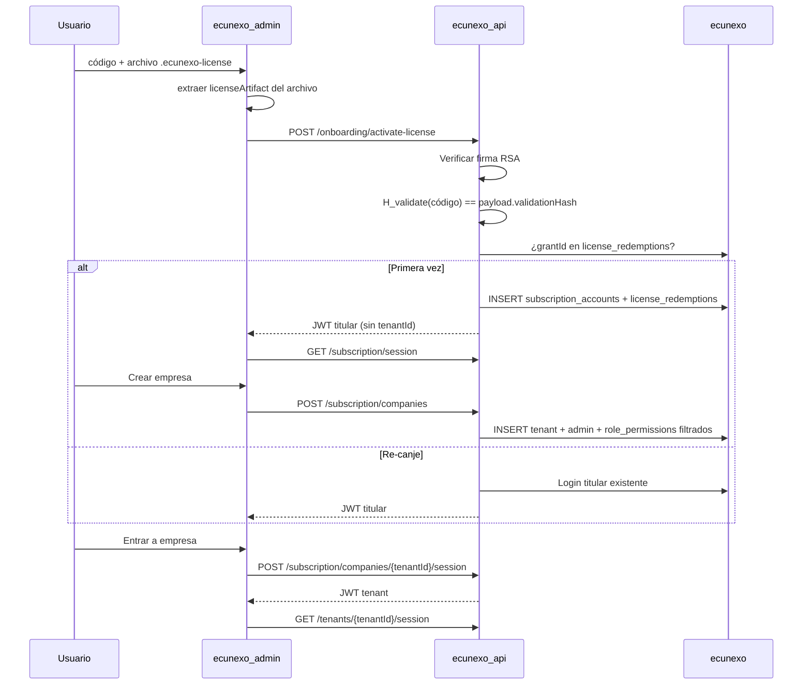

# Seguridad — licencias desacopladas

## 1. Amenaza que se mitiga

Un administrador del **despliegue cliente** no debe poder:

- Emitir licencias nuevas.
- Escribir en `licensing_ecunexo`.
- Llamar a `ecunexo_license_api` para **emitir** (no existe en su infraestructura).
- Reconstruir el pepper de **emisión** a partir del material de validación.

## 2. Dos aplicaciones, cero acoplamiento en runtime

| App | Carpeta | Puerto dev | BD | Rol |
|-----|---------|------------|-----|-----|
| **Platform** | `ecunexo_license_api/` | 5090 | `licensing_ecunexo` | Solo CEO/operadores Ecunexo — **emisión** |
| **Tenant** | `ecunexo_api/` | 5088 | `ecunexo` | Cliente final — **validación + aprovisionamiento** |

**Prohibido en tenant (emisión):**

- `ProjectReference` a `EcuNexo.Platform.*`
- `ConnectionStrings:Licensing`
- `ActivationCodes:IssuePepper` / clave privada RSA

**Permitido opcionalmente (solo validación):** consulta HTTP de solo lectura al endpoint de estado de platform cuando `LicenseValidation:PlatformApiBaseUrl` está configurado. Sin esa URL, el tenant opera solo con firma local + gracia offline según `onlineValidationIntervalDays`.

## 3. Doble hash (dominios separados)

Implementación: `EcuNexo.Core.Licensing.LicenseHashing` (compartido vía `EcuNexo.Core`, sin referenciar Platform).

| Hash | Pepper config | Quién lo tiene | Uso |
|------|---------------|----------------|-----|
| **Emisión** | `ActivationCodes:IssuePepper` | Solo `ecunexo_license_api` | `license_grants.code_hash` en licensing |
| **Validación** | `LicenseValidation:ValidationPepper` | Platform (al emitir) + Tenant (al canjear) | Dentro del artefacto firmado; el cliente recomputa y compara |

Prefijos de dominio en el payload del hash (no reutilizables entre sí):

- `ecunexo:license:issue:v1|{código normalizado}`
- `ecunexo:license:validate:v1|{código normalizado}`

Conocer `ValidationPepper` **no** permite calcular `code_hash` de emisión ni insertar grants.

## 4. Artefacto firmado (RSA-PSS SHA-256)

Al emitir, platform devuelve:

1. **`activationCodePlaintext`** — código que escribe el usuario (una sola vez, fuera de BD).
2. **`licenseArtifact`** — JSON con envelope `{ version, payloadBase64Url, signatureBase64Url }`.

El payload firmado incluye: `grantId`, `validationHash`, límites del plan, expiración, `provisioning` (tenant, owner, contraseña inicial), `onlineValidationIntervalDays` (1–90, default 30) y opcionalmente `supersedesGrantId` cuando la licencia reemplaza otra revocada.

| Secreto | Platform | Tenant |
|---------|----------|--------|
| Clave privada RSA (`LicenseSigning:PrivateKeyPem`) | Sí | **Nunca** |
| Clave pública RSA (`LicenseValidation:SigningPublicKeyPem`) | Opcional | **Sí** |

Sin la clave privada del CEO, no se fabrica un artefacto válido aunque se conozca `ValidationPepper`.

## 5. Flujo de canje (tenant, offline)



Tablas locales:

| Tabla | Uso |
|-------|-----|
| `tenancy.subscription_accounts` | Titular de licencia (email, plan, módulos, cupos). Un grant = una organización; el mismo VPS admite varias. |
| `tenancy.license_redemptions` | `grant_id` PK, `subscription_account_id`, `redeemed_at_utc` |
| `tenancy.tenants` | Empresas (`subscription_group_id` agrupa bajo la licencia) |

## 6. Configuración

### Platform (`ecunexo_license_api`)

```json
{
  "ActivationCodes": { "IssuePepper": "..." },
  "LicenseValidation": { "ValidationPepper": "..." },
  "LicenseSigning": { "PrivateKeyPath": "../../../ecunexo_api/dev-license-private.pem" },
  "Licensing": { "ProvisioningEncryptionKey": "..." }
}
```

`ProvisioningEncryptionKey` cifra copia de respaldo en `license_grants.provisioning_payload_encrypted` (solo licensing, auditoría Ecunexo).

### Tenant (`ecunexo_api`)

```json
{
  "LicenseValidation": {
    "ValidationPepper": "...",
    "SigningPublicKeyPath": "../dev-license-public.pem",
    "PlatformApiBaseUrl": "https://licensing.ecunexo.com",
    "PlatformApiKey": "..."
  }
}
```

- `PlatformApiBaseUrl` — opcional. Si está vacío, no hay validación online (solo expiración local + intervalo sin enforcement remoto).
- `PlatformApiKey` — cabecera `X-Platform-Validation-Key` hacia `GET /api/v1/platform/licenses/{grantId}/status`.

Entregar al cliente en despliegue: **mismo** `ValidationPepper` + **PEM público** que usa Ecunexo al firmar (vía contrato / vault, no repositorio).

### Desarrollo local

```powershell
pwsh scripts/Generate-DevLicenseKeys.ps1
```

Genera `ecunexo_api/dev-license-private.pem` (gitignored) y `dev-license-public.pem`.

## 7. API

### Emisión — `POST /api/v1/platform/licenses` (platform, JWT operador)

Respuesta 201 incluye `activationCodePlaintext`, `licenseArtifact`, `licenseId`, `expiresAtUtc`, etc.

### Canje — `POST /api/v1/onboarding/activate-license` (tenant, anónimo)

```json
{
  "activationCode": "XXXX-XXXX-...",
  "licenseArtifact": "{ \"version\":1, \"payloadBase64Url\":\"...\", \"signatureBase64Url\":\"...\" }"
}
```

## 8. Legacy

`tenancy.activation_codes` + `POST /onboarding/tenant-with-activation` siguen para **dev/seeds** con un solo pepper (`ActivationCodes:Pepper` en tenant). No usar para licencias comerciales nuevas.

## 9. Archivo `.ecunexo-license`

Implementado: ver [[11-formato-archivo-licencia]]. El cliente recibe código + archivo; el SPA envía el mismo `licenseArtifact` a la API.

## 10. Validación periódica online (implementado)

Al emitir, platform fija `onlineValidationIntervalDays` (1–90, default 30) en grant y artefacto. El tenant persiste en `subscription_accounts`:

| Campo | Uso |
|-------|-----|
| `license_expires_at_utc` | Fin de vigencia comercial |
| `online_validation_interval_days` | Gracia offline tras última validación OK |
| `last_online_license_validation_at_utc` | Marca de última consulta exitosa a platform |

En **login** (`LicenseComplianceService`):

1. Rechaza si `license_expires_at_utc` venció.
2. Si aún está dentro del intervalo desde `last_online_license_validation_at_utc`, permite acceso sin red.
3. Si venció el intervalo y `PlatformApiBaseUrl` está configurado, exige `GET .../licenses/{grantId}/status` con `isAllowed: true`.
4. Si venció el intervalo pero no hay URL configurada, solo aplica expiración local (despliegues air-gapped).

## 11. Reemisión (implementado)

Si el cliente pierde código o archivo:

1. Operador: `POST /api/v1/platform/licenses/{grantId}/reissue` — revoca grant anterior, emite uno nuevo con `supersedesGrantId`.
2. Cliente activa el nuevo `.ecunexo-license`; `ActivateLicense` detecta `supersedesGrantId`, actualiza titular y registra nueva redemption.
3. Grants revocados responden `isAllowed: false` en el endpoint de status.

Restricción de email duplicado en emisión: un solo grant **Active/Exhausted** por `owner_email_normalized`; revocada permite reemitir al mismo titular.

## 12. Fase 2 (opcional)

- Rotación de par de claves RSA.
- Validación online también en `GET /subscription/session` (hoy solo login).

## Enlaces

- [[10-modelo-titular-suscripcion-rbac]]
- [[08-plan-tablas-bd]]
- [`docs/adr/008-platform-licensing-admin.md`](../adr/008-platform-licensing-admin.md)
- [`ecunexo_license_api/docs/01-emision-licencias.md`](../../../ecunexo_license_api/docs/01-emision-licencias.md)
