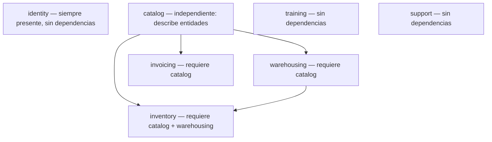

# Module Entitlements — tiers, límites y dependencias

Reemplaza la antigua lista plana `enabled_modules` por una estructura jerárquica con **tiers**, **límites transaccionales configurables** y **validación de dependencias entre módulos**.

## 1. Motivación

La lista plana `["identity","inventory","warehousing"]` no distinguía:

- Cuántos SKU puede tener un inventario pequeño vs uno corporativo.
- Que `inventory` **requiere** `catalog` y `warehousing`.
- Que los límites (bodegas, facturas mensuales, horas de soporte) deben ser configurables por plan y personalizables al emitir.

## 2. Modelo de datos

### 2.1 `ModuleEntitlement`

Record inmutable en `EcuNexo.Core/Tenancy/ModuleEntitlement.cs`:

| Campo | Tipo | Descripción |
|-------|------|-------------|
| `ModuleCode` | `string` | Código de módulo (`TenantModuleCodes`) |
| `Tier` | `ModuleTier` | Nivel de servicio contratado |
| `Limits` | `IReadOnlyDictionary<string,int>?` | Sobrescritos de límites. `null` = usar defaults del tier |

Métodos clave:

- `GetLimit(limitKey)` — resuelve un límite: primero `Limits` (sobrescritos), luego `ModuleTierCatalog`.
- `FromTier(moduleCode, tier)` — factory con defaults del tier.
- `FromTierWithOverrides(moduleCode, tier, limits)` — factory con sobrescritos.

### 2.2 `ModuleTier`

Enum en `EcuNexo.Core/Tenancy/ModuleTier.cs`:

| Valor | Etiqueta UI | Segmento |
|-------|-------------|----------|
| `Small` (0) | Sin tier | PyME básica |
| `Medium` (1) | Básico | Negocio en crecimiento |
| `Big` (2) | Estándar | Operación consolidada |
| `Enterprise` (3) | Avanzado | Sin restricciones |

Los nombres "Small/Medium/Big/Enterprise" son técnicos; la UI muestra etiquetas en español y los límites son totalmente personalizables por el operador.

### 2.3 `ModuleTierCatalog`

Catálogo estático en `EcuNexo.Core/Tenancy/ModuleTierCatalog.cs` con límites predefinidos por módulo y tier. Cada módulo define sus propias constantes de límite:

#### Inventory

| Límite | Small | Medium | Big | Enterprise |
|--------|-------|--------|-----|------------|
| `max_sku_count` | 100 | 500 | 2 000 | Ilimitado |
| `max_variants_per_item` | 5 | 10 | 25 | Ilimitado |
| `max_categories` | 10 | 20 | 50 | Ilimitado |

#### Warehousing

| Límite | Small | Medium | Big | Enterprise |
|--------|-------|--------|-----|------------|
| `max_warehouses` | 1 | 5 | 20 | Ilimitado |

#### Invoicing

| Límite | Small | Medium | Big | Enterprise |
|--------|-------|--------|-----|------------|
| `max_invoices_per_month` | 50 | 200 | 1 000 | Ilimitado |
| `invoice_history_months` | 3 | 6 | 12 | Ilimitado |

#### Identity

| Límite | Small | Medium | Big | Enterprise |
|--------|-------|--------|-----|------------|
| `max_users` | 3 | 10 | 25 | Ilimitado |

#### Training

| Límite | Small | Medium | Big | Enterprise |
|--------|-------|--------|-----|------------|
| `max_training_sessions_per_year` | 2 | 6 | 12 | Ilimitado |
| `max_training_hours_per_year` | 4 | 12 | 24 | Ilimitado |

#### Support

| Límite | Small | Medium | Big | Enterprise |
|--------|-------|--------|-----|------------|
| `max_support_hours_per_year` | 8 | 20 | 40 | Ilimitado |

> Los límites `max_invoices_per_month`, `max_training_sessions_per_year`, `max_training_hours_per_year` y `max_support_hours_per_year` son **transaccionales**: se resetean por período (mes/año calendario) y aplican por empresa (tenant). Al excederse, la operación se bloquea con `403 module.limit_exceeded`.

#### Catalog

Catalog no tiene límites numéricos; usa políticas ABAC con `allowed_item_kinds` (`service` vs `service,physical`). Se incluye en el catálogo para que el `ModuleEntitlementGuard` lo reconozca.

### 2.4 Métodos de `ModuleTierCatalog`

| Método | Uso |
|--------|-----|
| `GetDefaultLimit(moduleCode, tier, limitKey)` | Resuelve un límite individual |
| `GetDefaultsForTier(moduleCode, tier)` | Devuelve todos los defaults de un tier |
| `FromModuleCodesWithTier(moduleCodes, defaultTier)` | Migración: convierte lista plana legacy a entitlements |

## 3. Dependencias entre módulos — `ModuleDependencyGraph`

Clase estática en `EcuNexo.Core/Tenancy/ModuleDependencyGraph.cs`.

### 3.1 Jerarquía

### 3.2 Reglas

- **`identity`** siempre está presente y no tiene dependencias.
- **`catalog`** es independiente: describe ítems (productos y servicios).
- **`warehousing`** requiere `catalog` (ubicaciones físicas para ítems).
- **`inventory`** requiere `catalog` + `warehousing` (stock en ubicaciones).
- **`invoicing`** requiere `catalog` (documentos de venta sobre ítems).
- **`training`** y **`support`** no tienen dependencias.

### 3.3 Métodos de validación

| Método | Uso |
|--------|-----|
| `GetRequiredModules(moduleCode)` | Módulos que deben estar habilitados para usar este |
| `GetDependants(moduleCode)` | Módulos que dependen de este (directa y transitivamente) |
| `Validate(selectedModuleCodes)` | Errores si faltan dependencias |
| `ValidateTierConsistency(entitlements)` | Errores si un módulo tiene tier mayor que sus dependencias |

`ValidateTierConsistency` impide que, por ejemplo, `inventory` Medium (500 SKU) exista con `warehousing` Small (1 bodega). El tier de un módulo no puede superar el de sus prerrequisitos.

## 4. Integración con el sistema

### 4.1 Persistencia

`SubscriptionAccount.ModuleEntitlements` y `Tenant.ModuleEntitlements` almacenan la lista de entitlements. Se persisten como **jsonb** en PostgreSQL mediante EF Core `EnableDynamicJson()`.

Las columnas legacy `EnabledModuleCodes` (lista plana de strings) coexisten por compatibilidad. Para validaciones nuevas se prefiere `ModuleEntitlements`.

### 4.2 Flujo al emitir licencia

1. Platform API (`IssueLicenseHandler`): construye `List<ModuleEntitlement>` con los tiers y límites del plan + personalizaciones del operador.
2. `ModuleDependencyGraph.Validate()` verifica que los módulos seleccionados cumplan dependencias.
3. `ModuleDependencyGraph.ValidateTierConsistency()` verifica consistencia de tiers.
4. `SubscriptionAccount.Create()` persiste `ModuleEntitlements` en el tenant.
5. Al provisionar empresa (`ProvisionSubscriptionCompanyHandler`): copia `ModuleEntitlements` del titular al tenant.

### 4.3 Guard de acceso

`ModuleEntitlementGuard` en capa Business valida en cada petición:

1. El módulo del permiso solicitado (`PermissionModuleMapper`) debe estar en `ModuleEntitlements`.
2. Si el permiso tiene un límite transaccional asociado, `ModuleUsageCounter` verifica que no se haya excedido.
3. Si el módulo no está en los entitlements → `403 module.not_entitled`.

### 4.4 Menú

`UiAccessEvaluator` filtra ítems del menú SPA por los módulos en `ModuleEntitlements`.

## 5. Personalización (sobrescritos)

Al crear un plan o emitir una licencia, el operador puede sobrescribir cualquier límite individual del tier. Por ejemplo:

- Plan "Estándar" con `inventory` tier Big (2000 SKU) pero el cliente solo necesita 1500.
- `ModuleEntitlement.FromTierWithOverrides("inventory", ModuleTier.Big, new() { ["max_sku_count"] = 1500 })`

La UI del admin de licencias (`ecunexo_license`) muestra inputs editables para cada límite, inicializados con los defaults del tier.

## 6. Códigos de módulo

Definidos en `TenantModuleCodes`:

| Código | Módulo | Dependencias |
|--------|--------|--------------|
| `identity` | Identidad y acceso | Ninguna |
| `catalog` | Catálogo | Ninguna |
| `warehousing` | Bodegas | `catalog` |
| `inventory` | Inventario | `catalog`, `warehousing` |
| `invoicing` | Facturación | `catalog` |
| `training` | Capacitación | Ninguna |
| `support` | Soporte técnico | Ninguna |

## 7. Migraciones

| Migración | Contenido |
|-----------|-----------|
| `AddModuleEntitlements` | Columna `module_entitlements` (jsonb) en `subscription_accounts` y `tenants` |

La columna legacy `enabled_module_codes` se mantiene para compatibilidad con tenants anteriores.

## Enlaces

- [[08-plan-tablas-bd]]
- [[10-modelo-titular-suscripcion-rbac]]
- [[13-compliance-reissue]]
- [`../15-catalogo-vs-inventario-y-planes.md`](../15-catalogo-vs-inventario-y-planes.md)
- [ADR-006: Module-based permission filtering](../adr/006-module-permission-filter.md)
- [ADR-009: Catalog-Inventory separation](../adr/009-catalog-inventory-separation.md)
