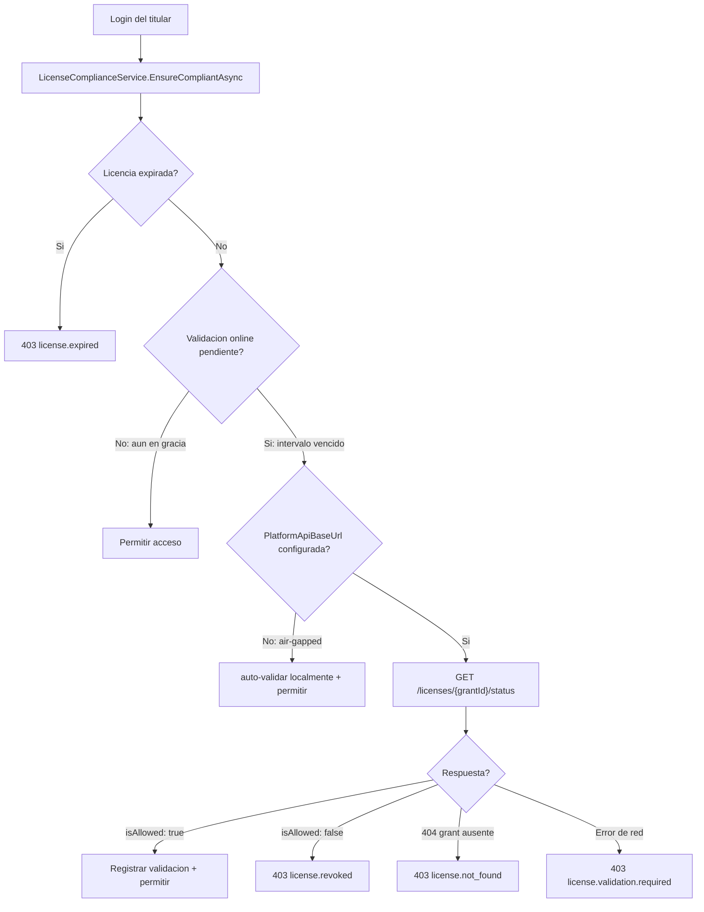
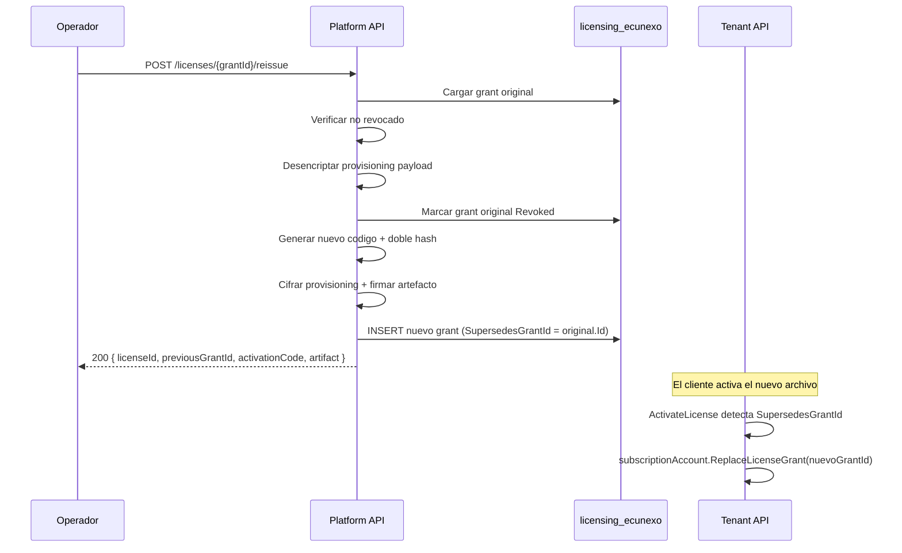

# Compliance y reemisión de licencias

## 1. License Compliance — validación en cada login

### 1.1 Objetivo

Asegurar que el titular de una licencia:

- No opere con una licencia **expirada**.
- Revalide periódicamente que la licencia sigue **activa** en Ecunexo (no revocada).
- Pueda operar **offline** durante un período de gracia configurable.

### 1.2 `LicenseComplianceService`

Implementado en `EcuNexo.Business/Tenancy/Licensing/LicenseComplianceService.cs`.

Se invoca en el handler de login (`LoginHandler`) **antes** de emitir el JWT. Recibe la entidad `SubscriptionAccount` del titular.



### 1.3 Lógica paso a paso

1. **Expiración absoluta** — si `utcNow >= LicenseExpiresAtUtc` → `403 license.expired`. Sin excepción.
2. **Gracia offline** — si `utcNow < LastOnlineLicenseValidationAtUtc.AddDays(OnlineValidationIntervalDays)` → acceso inmediato.
3. **Air-gapped** — si `PlatformApiBaseUrl` no está configurada → auto-renueva gracia localmente.
4. **Online** — consulta `GET /licenses/{grantId}/status` a platform. Si `isAllowed: true` → actualiza `LastOnlineLicenseValidationAtUtc`. Si `isAllowed: false` → `403 license.revoked`. Si **404** → `403 license.not_found` (el grant no está en `licensing_ecunexo`; típico si se recreó Platform y el tenant conserva `grant_id`). Si error de red o HTTP distinto de 200/404 → `403 license.validation.required`.

### 1.4 Campos en `SubscriptionAccount`

| Campo | Uso |
|-------|-----|
| `LicenseExpiresAtUtc` | Fecha de expiración absoluta de la licencia |
| `OnlineValidationIntervalDays` | Cada cuántos días se exige revalidación online (1–90, default 30) |
| `LastOnlineLicenseValidationAtUtc` | Marca de última validación exitosa |
| `CreatedAt` | Fecha de creación (ancla inicial para el primer intervalo) |

### 1.5 Métodos de dominio

| Método | Lógica |
|--------|--------|
| `IsLicenseExpired(utcNow)` | `utcNow >= LicenseExpiresAtUtc` |
| `IsOnlineValidationDue(utcNow)` | Compara con `(LastOnlineLicenseValidationAtUtc ?? CreatedAt).AddDays(OnlineValidationIntervalDays)` |
| `RecordOnlineValidation(utcNow)` | Actualiza `LastOnlineLicenseValidationAtUtc` al presente |

### 1.6 Modos de operación

| Configuración | Comportamiento |
|---------------|----------------|
| `PlatformApiBaseUrl` **configurada** | Validación online obligatoria cada `OnlineValidationIntervalDays` días |
| `PlatformApiBaseUrl` **vacía** | Solo expiración local; auto-renovación de gracia (despliegues air-gapped) |
| `PlatformApiBaseUrl` configurada pero **sin internet** | Error `license.validation.required` — bloquea hasta que haya conexión |
| Grant ausente en Platform (404) | Error `license.not_found` — no es un fallo de red |

## 2. `LicenseOnlineValidator`

Implementado en `EcuNexo.Api/Licensing/LicenseOnlineValidator.cs`.

### 2.1 Configuración

```json
{
  "LicenseValidation": {
    "PlatformApiBaseUrl": "https://licensing.ecunexo.com",
    "PlatformApiKey": "sk-..."
  }
}
```

| Clave | Obligatoria | Descripción |
|-------|-------------|-------------|
| `PlatformApiBaseUrl` | No | URL base de platform. Vacío = modo offline. |
| `PlatformApiKey` | No | Cabecera `X-Platform-Validation-Key` para autenticar la consulta |

### 2.2 Flujo HTTP

1. `GET {PlatformApiBaseUrl}/api/v1/platform/licenses/{grantId}/status`
2. Cabecera opcional: `X-Platform-Validation-Key: {PlatformApiKey}`
3. Respuesta esperada: `{ grantId, supersedesGrantId, status, expiresAtUtc, isAllowed, revokedAtUtc }`
4. `isAllowed: false` → licencia revocada o reemplazada.
5. `isAllowed: true` → tenant actualiza `LastOnlineLicenseValidationAtUtc`.

### 2.3 Errores

| Error | Causa |
|-------|-------|
| `license.online.not_found` | HTTP 404 (grant no existe en Platform) |
| `license.online.unavailable` | HTTP no 200 (distinto de 404) |
| `license.online.invalid_response` | JSON inválido |
| `license.online.network` | `HttpRequestException` o timeout |

## 3. Reemisión de licencias

### 3.1 Caso de uso

Cuando el cliente **pierde** código o archivo `.ecunexo-license`:

1. Operador Ecunexo ejecuta reemisión desde el admin de licencias.
2. Grant anterior se **revoca**.
3. Se emite grant **nuevo** con `SupersedesGrantId` apuntando al anterior.
4. Nuevo código + nuevo artefacto firmado.

### 3.2 Endpoint

`POST /api/v1/platform/licenses/{grantId}/reissue` (JWT operador)

### 3.3 Flujo completo



### 3.4 Handler — `ReissueLicenseHandler`

Validaciones:

1. Grant original existe y no está revocado.
2. Se puede desencriptar `ProvisioningPayloadEncrypted` del grant original.
3. Se genera nuevo código con `ActivationCodeGenerator`.
4. Se calculan ambos hashes (`IssuePepper` + `ValidationPepper`).
5. Se firma el artefacto con clave privada RSA.

### 3.5 Datos que se preservan

- `CustomerId`, `PlanCode`, `PlanLabel`, límites (`MaxTenants`, `MaxUsers`, `MaxWarehouses`)
- `EnabledModuleCodes`, `ModuleEntitlements`, `DeploymentMode`
- `ValidityDays`, `Notes`
- Datos del titular (email, nombre, contraseña)

### 3.6 En el lado del tenant (canje de reemisión)

1. `ActivateLicenseHandler` detecta `SupersedesGrantId` en el artefacto.
2. Busca `SubscriptionAccount` por el `GrantId` anterior (vía `license_redemptions`).
3. Invoca `SubscriptionAccount.ReplaceLicenseGrant(nuevoGrantId, ...)`:
   - Actualiza `GrantId`, `ServicePlan`, `LicenseExpiresAtUtc`, `OnlineValidationIntervalDays`.
   - Opcionalmente actualiza `EnabledModuleCodes` y `ModuleEntitlements`.
   - Registra `LastOnlineLicenseValidationAtUtc = now`.
4. Inserta nueva fila en `license_redemptions` con el nuevo `grantId`.

### 3.7 Grants revocados

- Grants con `status = Revoked` responden `isAllowed: false` en `GET /licenses/{grantId}/status`.
- Tenant con grant revocado → `403 license.revoked` en próximo login.
- La reemisión no elimina el grant anterior; lo marca `Revoked` con auditoría.

## 4. `LicenseValidationPolicy`

Clase en `EcuNexo.Core/Licensing/LicenseValidationPolicy.cs`:

| Constante | Valor |
|-----------|-------|
| `DefaultIntervalDays` | 30 |
| `MinIntervalDays` | 1 |
| `MaxIntervalDays` | 90 |

Método `NormalizeIntervalDays(days)`: clamp a `[1, 90]`.

## 5. Configuración

### Platform (`ecunexo_license_api`)

```json
{
  "LicenseValidation": { "ValidationPepper": "..." },
  "LicenseSigning": { "PrivateKeyPath": "dev-license-private.pem" },
  "Licensing": { "ProvisioningEncryptionKey": "..." }
}
```

### Tenant (`ecunexo_api`)

```json
{
  "LicenseValidation": {
    "ValidationPepper": "...",
    "SigningPublicKeyPath": "dev-license-public.pem",
    "PlatformApiBaseUrl": "https://licensing.ecunexo.com",
    "PlatformApiKey": "..."
  }
}
```

## Enlaces

- [[09-seguridad-licencias-desacopladas]] — doble hash y artefacto firmado
- [[10-modelo-titular-suscripcion-rbac]] — flujo titular a empresas
- [[12-module-entitlements]] — tiers y limites transaccionales
- [[11-formato-archivo-licencia]] — archivo `.ecunexo-license`
- [`../14-onboarding-y-codigos-activacion.md`](../14-onboarding-y-codigos-activacion.md)
